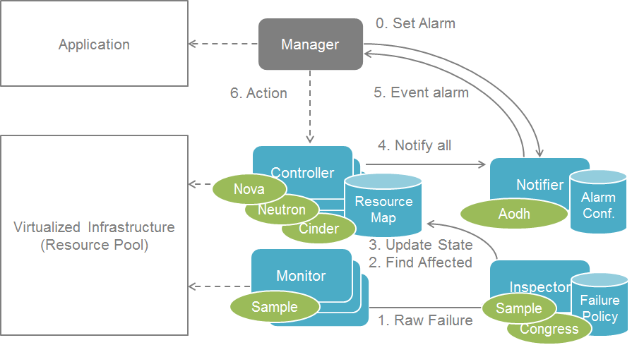
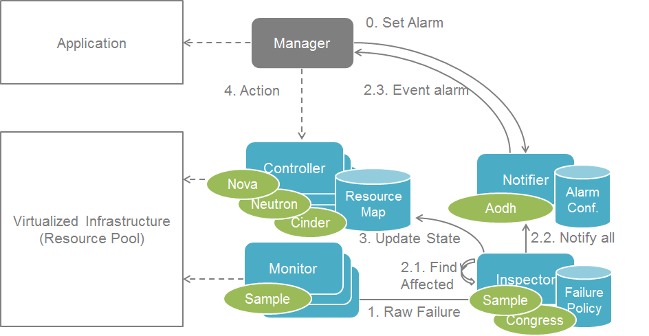
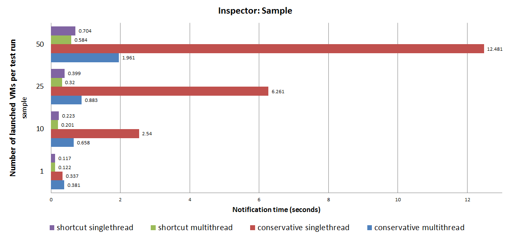

.. This work is licensed under a Creative Commons Attribution 4.0 International License.
.. http://creativecommons.org/licenses/by/4.0

==========================
Inspector Design Guideline
==========================

.. NOTE::
   This is spec draft of design guideline for inspector component.
   JIRA ticket to track the update and collect comments: `DOCTOR-73`_.

This document summarize the best practise in designing a high performance
inspector to meet the requirements in `OPNFV Doctor project`_.

Problem Description
===================

Some pitfalls has be detected during the development of sample inspector, e.g.
we suffered a significant `performance degrading in listing VMs in a host`_.

A `patch set for caching the list`_ has been committed to solve issue. When a
new inspector is integrated, it would be nice to have an evaluation of existing
design and give recommendations for improvements.

This document can be treated as a source of related blueprints in inspector
projects.

Guidelines
==========

Host specific VMs list
----------------------

While requirement in doctor project is to have alarm about fault to consumer in one second, it is just a limit we have
set in requirements. When talking about fault management in Telco, the implementation needs to be by all means optimal
and the one second is far from traditional Telco requirements.

One thing to be optimized in inspector is to eliminate the need to read list of host specific VMs from Nova API, when
it gets a host specific failure event. Optimal way of implementation would be to initialize this list when Inspector
start by reading from Nova API and after this list would be kept up-to-date by ``instance.update`` notifications
received from nova. Polling Nova API can be used as a complementary channel to make snapshot of hosts and VMs list in
order to keep the data consistent with reality.

This is enhancement and not perhaps something needed to keep under one second in a small system. Anyhow this would be
something needed in case of production use.

This guideline can be summarized as following:

- cache the host VMs mapping instead of reading it on request
- subscribe and handle update notifications to keep the list up to date
- make snapshot periodically to ensure data consistency

Parallel execution
------------------

In doctor's architecture, the inspector is responsible to set error state for the affected VMs in order to notify the
consumers of such failure. This is done by calling the nova `reset-state`_ API. However, this action is a synchronous
request with many underlying steps and cost typically hundreds of milliseconds. According to the
`discussion in mailing list`_, this time cost will grow linearly if the requests are sent one by one. It will become
a critical issue in large scale system.

It is recommended to introduce **parallel execution** for actions like ``reset-state`` that takes a list of targets.

Shortcut notification
---------------------

An alternative way to improve notification performance is to take a shortcut from inspector to notifier instead of
triggering it from controller. The difference between the two workflow is shown below:

   Conservative Notification

   Shortcut Notification

It worth noting that the shortcut notification has a side effect that cloud resource states could still be out-of-sync
by the time consumer processes the alarm notification. This is out of scope of inspector design but need to be taken
consideration in system level.

Also the call of "reset servers state to error" is not necessary in the alternative notification case where the "host
forced down" is still called. "get-valid-server-state" was implemented to have valid server state while earlier one
couldn't get it unless calling "reset servers state to error". When not having "reset servers state to error", states
are more unlikely to be out of sync while notification and force down host would be parallel.

Appendix
========

A study has been made to evaluate the effect of parallel execution and shortcut notification on OPNFV Beijing Summit
2017.

   Notification Time

Download the `full presentation slides`_ here.

.. _DOCTOR-73: https://jira.opnfv.org/browse/DOCTOR-73
.. _OPNFV Doctor project: https://wiki.opnfv.org/doctor
.. _performance degrading in listing VMs in a host: https://lists.opnfv.org/pipermail/opnfv-tech-discuss/2016-September/012591.html
.. _patch set for caching the list: https://gerrit.opnfv.org/gerrit/#/c/20877/
.. _DOCTOR-76: https://jira.opnfv.org/browse/DOCTOR-76
.. _discussion in mailing list: https://lists.opnfv.org/pipermail/opnfv-tech-discuss/2016-October/013036.html
.. _reset-state: https://developer.openstack.org/api-ref/compute/#reset-server-state-os-resetstate-action
.. _full presentation slides: https://wiki.opnfv.org/download/attachments/5046291/doctor_qtip_faster_higher_stronger.pdf