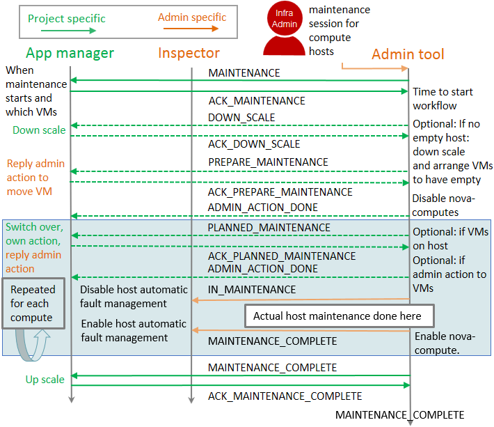

.. This work is licensed under a Creative Commons Attribution 4.0 International License.
.. http://creativecommons.org/licenses/by/4.0

====================================
Planned Maintenance Design Guideline
====================================

This document describes how one can implement infrastructure maintenance in
interaction with VNFM by utilizing the `OPNFV Doctor project`_ framework and to
meet the set requirements. Document concentrates to OpenStack and VMs while
the concept designed is generic for any payload or even different VIM. Admin
tool should be also for controller and other cloud hardware, but that is not the
main focus in OPNFV Doctor and should be defined better in the upstream
implementation. Same goes for any more detailed work to be done.

Problem Description
===================

Telco application need to know when infrastructure maintenance is going to happen
in order to guarantee zero down time in its operation. It needs to be possible
to make own actions to have application running on not affected resource or give
guidance to admin actions like migration. More details are defined in
requirement documentation: `use cases`_, `architecture`_ and `implementation`_.

Guidelines
==========

Concepts used:

- `event`: Notification to rabbitmq with particular event type.

- `state event`: Notification to rabbitmq with particular event type including
  payload with variable defined for state.

- `rolling maintenance`: Node by Node rolling maintenance and upgrade where
  a single node at a time will be maintained after a possible application
  payload is moved away from the node.

- `project` stands for `application` in OpenStack contents and both are used in
  this document. `tenant` is many times used for the same.

Infrastructure admin needs to make notification with two different event types.
One is meant for admin and one for project. Notification payload can be consumed
by application and admin by subscribing to corresponding event alarm trough
alarming service like OpenStack AODH.

- Infrastructure admin needs to make a notification about infrastructure
  maintenance including all details that application needs in order to make
  a decisions upon his affected service. Alarm Payload can hold a link to
  infrastructure admin tool API for reply and for other possible information.
  There is many steps of communication between admin tool and application, thus
  the payload needed for the information passed is very similar. Because of
  this, the same event type can be used, but there can be a variable like
  `state` to tell application what is needed as action for each event.
  If a project have not subscribed to alarm, admin tool responsible for the
  maintenance will assume it can do maintenance operations without interaction
  with application on top of it.

- Infrastructure admin needs to make an event about infrastructure maintenance
  telling when the maintenance starts and another when it ends. This admin level
  event should include the host name. This could be consumed by any admin level
  infrastructure entity. In this document we consume this in `Inspector` that
  is in `OPNFV Doctor project`_ terms infrastructure entity responsible for
  automatic host fault management. Automated actions surely needs to be disabled
  during planned maintenance.

Before maintenance starts application needs to be able to make switch over for
his ACT-STBY service affected, do operation to move service to not effected part
of infrastructure or give a hint for admin operation like migration that can be
automatically issued by admin tool according to agreed policy.

There should be at least one empty host compatible to host under maintenance in
order to have a smooth `rolling maintenance` done. For this to be possible also
down scaling the application instances should be possible.

Infrastructure admin should have a tool that is responsible for hosting a
maintenance work flow session with needed APIs for admin and for applications.
The Group of hosts in single maintenance session should always have the same
physical capabilities, so the rolling maintenance can be guaranteed.

Flow diagram is meant to be as high level as possible. It currently does not try
to be perfect, but to show the most important interfaces needed between VNFM and
infrastructure admin. This can be seen e.g. as missing error handling that can
be defined later on.

Flow diagram:

Flow diagram step by step:

- Infrastructure admin makes a maintenance session to maintain and upgrade
  certain group of hardware. At least compute hardware in single session should
  be having same capabilities like the amount number of VCPUs to ensure
  the maintenance can be done node by node in rolling fashion. Maintenance
  session need to have a `session_id` that is a unique ID to be carried
  throughout all events and can be used in APIs needed when interacting with
  the session. Maintenance session needs to have knowledge about when
  maintenance will start and what capabilities the possible upgrade to
  infrastructure will bring to application payload on top of it. It will be
  matter of the implementation to define in more detail wither some more data is
  needed when creating a session or if it is defined in the admin tool
  configuration.

  There can be several parallel maintenance sessions and a single session can
  include multiple projects payload.

- State `MAINTENANCE` project event and reply `ACK_MAINTENANCE`. Immediately
  after a maintenance session is created, infrastructure admin tool will send
  a project specific 'notification' which application manager can consume by
  subscribing to AODH alarm for this event. As explained already earlier all
  project events will only be sent in case the project subscribes to alarm and
  otherwise the interaction with application will simply not be done and
  operations will simple be forced.

  The state `MAINTENANCE` event should at least include:

    - `session_id` to reference correct maintenance session.
    - `state` as `MAINTENANCE` to identify event action needed.
    - `instance_ids` to tell project which of his instances will be affected by
      the maintenance. This might be a link to admin tool project specific API
      as AODH variables are limited to string of 255 character.
    - `reply_url` for application to call admin tool project specific API to
      answer `ACK_MAINTENANCE` including the `session_id`.
    - `project_id` to identify project.
    - `actions_at` time stamp to indicate when maintenance work flow will start.
      `ACK_MAINTENANCE` reply is needed before that time.
    - `metadata` to include key values pairs of a capabilities coming over the
      maintenance operation like 'openstack_version': 'Queens'

- Optional state `DOWN_SCALE` project event and reply `ACK_DOWN_SCALE`. When it
  is time to start the maintenance work flow as the time reaches the `actions_at`
  defined in previous state event, admin tool needs to check if there is already
  an empty compute host needed by the `rolling maintenance`. In case there is no
  empty host, admin tool can ask application to down scale by sending project
  specific `DOWN_SCALE` state event.

  The state `DOWN_SCALE` event should at least include:

    - `session_id` to reference correct maintenance session.
    - `state` as `DOWN_SCALE` to identify event action needed.
    - `reply_url` for application to call admin tool project specific API to
      answer `ACK_DOWN_SCALE` including the `session_id`.
    - `project_id` to identify project.
    - `actions_at` time stamp to indicate when is the last moment to send
      `ACK_DOWN_SCALE`. This means application can have time to finish some
      ongoing transactions before down scaling his instances. This guarantees
      a zero downtime for his service.

- Optional state `PREPARE_MAINTENANCE` project event and reply
  `ACK_PREPARE_MAINTENANCE`. In case still after down scaling the applications
  there is still no empty compute host, admin tools needs to analyze the
  situation on compute host under maintenance. It needs to choose compute node
  that is now almost empty or has otherwise least critical instances running if
  possible, like looking if there is floating IPs. When compute host is chosen,
  a `PREPARE_MAINTENANCE` state event can be sent to projects having instances
  running on this host to migrate them to other compute hosts. It might also be
  possible to have another round of `DOWN_SCALE` state event if necessary, but
  this is not proposed here.

  The state `PREPARE_MAINTENANCE` event should at least include:

    - `session_id` to reference correct maintenance session.
    - `state` as `PREPARE_MAINTENANCE` to identify event action needed.
    - `instance_ids` to tell project which of his instances will be affected by
      the state event. This might be a link to admin tool project specific API
      as AODH variables are limited to string of 255 character.
    - `reply_url` for application to call admin tool project specific API to
      answer `ACK_PREPARE_MAINTENANCE` including the `session_id` and
      `instance_ids` with list of key value pairs with key as `instance_id` and
      chosen action from allowed actions given via `allowed_actions` as value.
    - `project_id` to identify project.
    - `actions_at` time stamp to indicate when is the last moment to send
      `ACK_PREPARE_MAINTENANCE`. This means application can have time to finish
      some ongoing transactions within his instances and make possible
      switch over. This guarantees a zero downtime for his service.
    - `allowed_actions` to tell what admin tool supports as action to move
      instances to another compute host. Typically a list like: `['MIGRATE', 'LIVE_MIGRATE']`
 
- Optional state `ADMIN_ACTION_DONE` project event. In case admin tool needed to
  make action to move instance like migrating it to another compute host, this
  state event will be sent to tell the operation is complete.

  The state `ADMIN_ACTION_DONE` event should at least include:

    - `session_id` to reference correct maintenance session.
    - `instance_ids` to tell project which of his instance had the admin action
      done.
    - `project_id` to identify project.

- At this state it is guaranteed there is an empty compute host. It would be
  maintained first trough `IN_MAINTENANCE` and `MAINTENANCE_COMPLETE` steps, but
  following the flow chart `PLANNED_MAINTENANCE` will be explained next.

- Optional state `PLANNED_MAINTENANCE` project event and reply
  `ACK_PLANNED_MAINTENANCE`. In case compute host to be maintained has
  instances, projects owning those should have this state event. When project
  receives this state event it knows instances moved to other compute host as
  resulting actions will now go to host that is already maintained. This means
  it might have new capabilities that project can take into use. This gives the
  project the possibility to upgrade his instances also to support new
  capabilities over the action chosen to move instances.

  The state `PLANNED_MAINTENANCE` event should at least include:

    - `session_id` to reference correct maintenance session.
    - `state` as `PLANNED_MAINTENANCE` to identify event action needed.
    - `instance_ids` to tell project which of his instances will be affected by
      the event. This might be a link to admin tool project specific API as AODH
      variables are limited to string of 255 character.
    - `reply_url` for application to call admin tool project specific API to
      answer `ACK_PLANNED_MAINTENANCE` including the `session_id` and
      `instance_ids` with list of key value pairs with key as `instance_id` and
      chosen action from allowed actions given via `allowed_actions` as value.
    - `project_id` to identify project.
    - `actions_at` time stamp to indicate when is the last moment to send
      `ACK_PLANNED_MAINTENANCE`. This means application can have time to finish
      some ongoing transactions within his instances and make possible switch
      over. This guarantees a zero downtime for his service.
    - `allowed_actions` to tell what admin tool supports as action to move
      instances to another compute host. Typically a list like: `['MIGRATE', 'LIVE_MIGRATE', 'OWN_ACTION']`
      `OWN_ACTION` means that application may want to re-instantiate his
      instance perhaps to take into use the new capability coming over the
      infrastructure maintenance. Re-instantiated instance will go to already
      maintained host having the new capability.
    - `metadata` to include key values pairs of a capabilities coming over the
      maintenance operation like 'openstack_version': 'Queens'

- `State IN_MAINTENANCE` and `MAINTENANCE_COMPLETE` admin events. Just before
  host goes to maintenance the IN_MAINTENANCE` state event will be send to
  indicate host is entering to maintenance. Host is then taken out of production
  and can be powered off, replaced, or rebooted during the operation.
  During the maintenance and upgrade host might be moved to admin's own host
  aggregate, so it can be tested to work before putting back to production.
  After maintenance is complete `MAINTENANCE_COMPLETE` state event will be sent
  to know host is back in use. Adding or removing of a host is yet not
  included in this concept, but can be addressed later.

  The state `IN_MAINTENANCE` and `MAINTENANCE_COMPLETE` event should at least
  include:

    - `session_id` to reference correct maintenance session.
    - `state` as `IN_MAINTENANCE` or `MAINTENANCE_COMPLETE` to indicate host
      state.
    - `project_id` to identify admin project needed by AODH alarm.
    - `host` to indicate the host name.

- State `MAINTENANCE_COMPLETE` project event and reply
  `MAINTENANCE_COMPLETE_ACK`. After all compute nodes in the maintenance session
  have gone trough maintenance operation this state event can be send to all
  projects that had instances running on any of those nodes. If there was a down
  scale done, now the application could up scale back to full operation.
  
    - `session_id` to reference correct maintenance session.
    - `state` as `MAINTENANCE_COMPLETE` to identify event action needed.
    - `instance_ids` to tell project which of his instances are currently
      running on hosts maintained in this maintenance session. This might be a
      link to admin tool project specific API as AODH variables are limited to
      string of 255 character.
    - `reply_url` for application to call admin tool project specific API to
      answer `ACK_MAINTENANCE` including the `session_id`.
    - `project_id` to identify project.
    - `actions_at` time stamp to indicate when maintenance work flow will start.
    - `metadata` to include key values pairs of a capabilities coming over the
      maintenance operation like 'openstack_version': 'Queens'

- At the end admin tool maintenance session can enter to `MAINTENANCE_COMPLETE`
  state and session can be removed.

Benefits
========

- Application is guaranteed zero downtime as it is aware of the maintenance
  action affecting its payload. The application is made aware of the maintenance
  time window to make sure it can prepare for it.
- Application gets to know new capabilities over infrastructure maintenance and
  upgrade and can utilize those (like do its own upgrade)
- Any application supporting the interaction being defined could be running on
  top of the same infrastructure provider. No vendor lock-in for application.
- Any infrastructure component can be aware of host(s) under maintenance via
  admin events about host state. No vendor lock-in for infrastructure
  components.
- Generic messaging making it possible to use same concept in different type of
  clouds and application payloads. `instance_ids` will uniquely identify any
  type of instance and similar notification payload can be used regardless we
  are in OpenStack. Work flow just need to support different cloud
  infrastructure management to support different cloud.
- No additional hardware is needed during maintenance operations as down- and
  up-scaling can be supported for the applications. Optional, if no extensive
  spare capacity is available for the maintenance - as typically the case in
  Telco environments.
- Parallel maintenance sessions for different group of hardware. Same session
  should include hardware with same capabilities to guarantee `rolling
  maintenance` actions.
- Multi-tenancy support. Project specific messaging about maintenance.

Future considerations
=====================

- Pluggable architecture for infrastructure admin tool to handle different
  clouds and payloads.
- Pluggable architecture to handle specific maintenance/upgrade cases like
  OpenStack upgrade between specific versions or admin testing before giving
  host -back to production.
- Support for user specific details need to be taken into account in admin side
  actions (e.g. run a script, ...).
- (Re-)Use existing implementations like Mistral for work flows.
-  Adding and removing a host as an action.

POC
---

There was a `Maintenance POC`_ demo 'How to gain VNF zero down-time during
Infrastructure Maintenance and Upgrade' in the OCP and ONS summit March 2018.
Similar concept is also being made as `OPNFV Doctor project`_ new test case
scenario.

.. _OPNFV Doctor project: https://wiki.opnfv.org/doctor
.. _use cases: http://artifacts.opnfv.org/doctor/docs/requirements/02-use_cases.html#nvfi-maintenance
.. _architecture: http://artifacts.opnfv.org/doctor/docs/requirements/03-architecture.html#nfvi-maintenance
.. _implementation:  http://artifacts.opnfv.org/doctor/docs/requirements/05-implementation.html#nfvi-maintenance
.. _Maintenance POC: https://youtu.be/7q496Tutzlo
