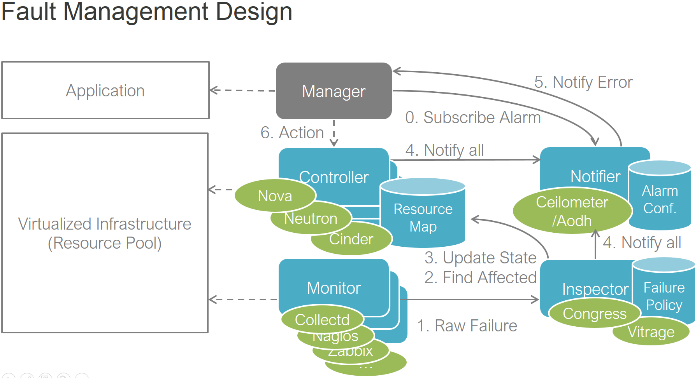
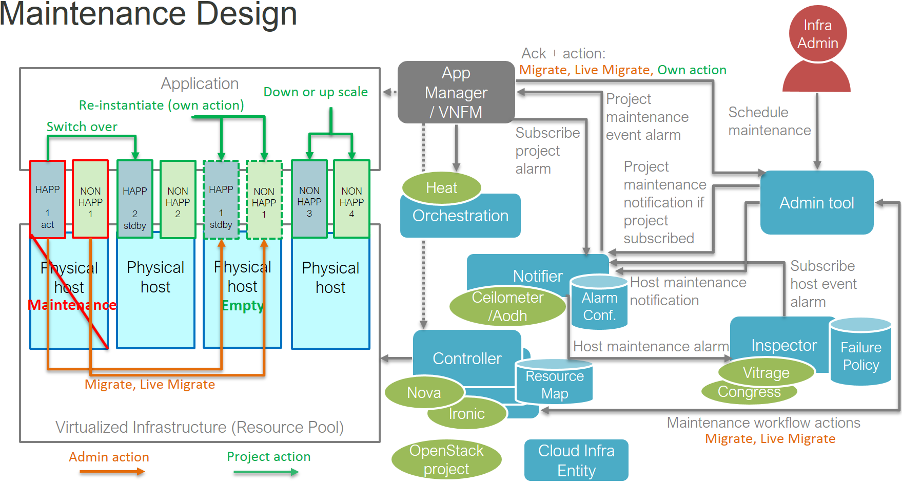
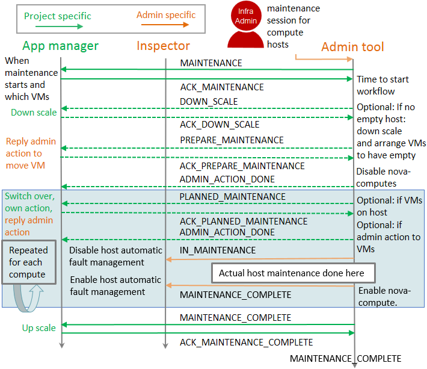

.. This work is licensed under a Creative Commons Attribution 4.0 International License.
.. http://creativecommons.org/licenses/by/4.0

Platform overview
"""""""""""""""""

Doctor platform provides these features since `Danube Release <https://wiki.opnfv.org/display/SWREL/Danube>`_:

* Immediate Notification
* Consistent resource state awareness for compute host down
* Valid compute host status given to VM owner

These features enable high availability of Network Services on top of
the virtualized infrastructure. Immediate notification allows VNF managers
(VNFM) to process recovery actions promptly once a failure has occurred.
Same framework can also be utilized to have VNFM awareness about
infrastructure maintenance.

Consistency of resource state is necessary to execute recovery actions
properly in the VIM.

Ability to query host status gives VM owner the possibility to get
consistent state information through an API in case of a compute host
fault.

The Doctor platform consists of the following components:

* OpenStack Compute (Nova)
* OpenStack Networking (Neutron)
* OpenStack Telemetry (Ceilometer)
* OpenStack Alarming (AODH)
* Doctor Sample Inspector, OpenStack Congress or OpenStack Vitrage
* Doctor Sample Monitor or any monitor supported by Congress or Vitrage

.. note::
    Doctor Sample Monitor is used in Doctor testing. However in real
    implementation like Vitrage, there are several other monitors supported.

You can see an overview of the Doctor platform and how components interact in
:numref:`figure-p1`.

    Doctor platform and typical sequence

Detailed information on the Doctor architecture can be found in the Doctor
requirements documentation:
http://artifacts.opnfv.org/doctor/docs/requirements/05-implementation.html

Running test cases
""""""""""""""""""

Functest will call the "doctor_tests/main.py" in Doctor to run the test job.
Doctor testing can also be triggered by tox on OPNFV installer jumphost. Tox
is normally used for functional, module and coding style testing in Python
project.

Currently, 'Apex', 'MCP' and 'local' installer are supported.

Fault management use case
"""""""""""""""""""""""""

* A consumer of the NFVI wants to receive immediate notifications about faults
  in the NFVI affecting the proper functioning of the virtual resources.
  Therefore, such faults have to be detected as quickly as possible, and, when
  a critical error is observed, the affected consumer is immediately informed
  about the fault and can switch over to the STBY configuration.

The faults to be monitored (and at which detection rate) will be configured by
the consumer. Once a fault is detected, the Inspector in the Doctor
architecture will check the resource map maintained by the Controller, to find
out which virtual resources are affected and then update the resources state.
The Notifier will receive the failure event requests sent from the Controller,
and notify the consumer(s) of the affected resources according to the alarm
configuration.

Detailed workflow information is as follows:

* Consumer(VNFM): (step 0) creates resources (network, server/instance) and an
  event alarm on state down notification of that server/instance or Neutron
  port.

* Monitor: (step 1) periodically checks nodes, such as ping from/to each
  dplane nic to/from gw of node, (step 2) once it fails to send out event
  with "raw" fault event information to Inspector

* Inspector: when it receives an event, it will (step 3) mark the host down
  ("mark-host-down"), (step 4) map the PM to VM, and change the VM status to
  down. In network failure case, also Neutron port is changed to down.

* Controller: (step 5) sends out instance update event to Ceilometer. In network
  failure case, also Neutron port is changed to down and corresponding event is
  sent to Ceilometer.

* Notifier: (step 6) Ceilometer transforms and passes the events to AODH,
  (step 7) AODH will evaluate events with the registered alarm definitions,
  then (step 8) it will fire the alarm to the "consumer" who owns the
  instance

* Consumer(VNFM): (step 9) receives the event and (step 10) recreates a new
  instance

Fault management test case
""""""""""""""""""""""""""

Functest will call the 'doctor-test' command in Doctor to run the test job.

The following steps are executed:

Firstly, get the installer ip according to the installer type. Then ssh to
the installer node to get the private key for accessing to the cloud. As
'fuel' installer, ssh to the controller node to modify nova and ceilometer
configurations.

Secondly, prepare image for booting VM, then create a test project and test
user (both default to doctor) for the Doctor tests.

Thirdly, boot a VM under the doctor project and check the VM status to verify
that the VM is launched completely. Then get the compute host info where the VM
is launched to verify connectivity to the target compute host. Get the consumer
ip according to the route to compute ip and create an alarm event in Ceilometer
using the consumer ip.

Fourthly, the Doctor components are started, and, based on the above preparation,
a failure is injected to the system, i.e. the network of compute host is
disabled for 3 minutes. To ensure the host is down, the status of the host
will be checked.

Finally, the notification time, i.e. the time between the execution of step 2
(Monitor detects failure) and step 9 (Consumer receives failure notification)
is calculated.

According to the Doctor requirements, the Doctor test is successful if the
notification time is below 1 second.

Maintenance use case
""""""""""""""""""""

* A consumer of the NFVI wants to interact with NFVI maintenance, upgrade,
  scaling and to have graceful retirement. Receiving notifications over these
  NFVI events and responding to those within given time window, consumer can
  guarantee zero downtime to his service.

The maintenance use case adds the Doctor platform an `admin tool` and an
`app manager` component. Overview of maintenance components can be seen in
:numref:`figure-p2`.

    Doctor platform components in maintenance use case

In maintenance use case, `app manager` (VNFM) will subscribe to maintenance
notifications triggered by project specific alarms through AODH. This is the way
it gets to know different NFVI maintenance, upgrade and scaling operations that
effect to its instances. The `app manager` can do actions depicted in `green
color` or tell `admin tool` to do admin actions depicted in `orange color`

Any infrastructure component like `Inspector` can subscribe to maintenance
notifications triggered by host specific alarms through AODH. Subscribing to the
notifications needs admin privileges and can tell when a host is out of use as
in maintenance and when it is taken back to production.

Maintenance test case
"""""""""""""""""""""

Maintenance test case is currently running in our Apex CI and executed by tox.
This is because the special limitation mentioned below and also the fact we
currently have only sample implementation as a proof of concept and we also
support unofficial OpenStack project Fenix. Environment variable
TEST_CASE='maintenance' needs to be used when executing "doctor_tests/main.py"
and ADMIN_TOOL_TYPE='fenix' if want to test with Fenix instead of sample
implementation. Test case workflow can be seen in :numref:`figure-p3`.

    Maintenance test case workflow

In test case all compute capacity will be consumed with project (VNF) instances.
For redundant services on instances and an empty compute needed for maintenance,
test case will need at least 3 compute nodes in system. There will be 2
instances on each compute, so minimum number of VCPUs is also 2. Depending on
how many compute nodes there is application will always have 2 redundant
instances (ACT-STDBY) on different compute nodes and rest of the compute
capacity will be filled with non-redundant instances.

For each project specific maintenance message there is a time window for
`app manager` to make any needed action. This will guarantee zero
down time for his service. All replies back are done by calling `admin tool` API
given in the message.

The following steps are executed:

Infrastructure admin will call `admin tool` API to trigger maintenance for
compute hosts having instances belonging to a VNF.

Project specific `MAINTENANCE` notification is triggered to tell `app manager`
that his instances are going to hit by infrastructure maintenance at a specific
point in time. `app manager` will call `admin tool` API to answer back
`ACK_MAINTENANCE`.

When the time comes to start the actual maintenance workflow in `admin tool`,
a `DOWN_SCALE` notification is triggered as there is no empty compute node for
maintenance (or compute upgrade). Project receives corresponding alarm and scales
down instances and call `admin tool` API to answer back `ACK_DOWN_SCALE`.

As it might happen instances are not scaled down (removed) from a single
compute node, `admin tool` might need to figure out what compute node should be
made empty first and send `PREPARE_MAINTENANCE` to project telling which instance
needs to be migrated to have the needed empty compute. `app manager` makes sure
he is ready to migrate instance and call `admin tool` API to answer back
`ACK_PREPARE_MAINTENANCE`. `admin tool` will make the migration and answer
`ADMIN_ACTION_DONE`, so `app manager` knows instance can be again used.

:numref:`figure-p3` has next a light blue section of actions to be done for each
compute. However as we now have one empty compute, we will maintain/upgrade that
first. So on first round, we can straight put compute in maintenance and send
admin level host specific `IN_MAINTENANCE` message. This is caught by `Inspector`
to know host is down for maintenance. `Inspector` can now disable any automatic
fault management actions for the host as it can be down for a purpose. After
`admin tool` has completed maintenance/upgrade `MAINTENANCE_COMPLETE` message
is sent to tell host is back in production.

Next rounds we always have instances on compute, so we need to have
`PLANNED_MAINTANANCE` message to tell that those instances are now going to hit
by maintenance. When `app manager` now receives this message, he knows instances
to be moved away from compute will now move to already maintained/upgraded host.
In test case no upgrade is done on application side to upgrade instances
according to new infrastructure capabilities, but this could be done here as
this information is also passed in the message. This might be just upgrading
some RPMs, but also totally re-instantiating instance with a new flavor. Now if
application runs an active side of a redundant instance on this compute,
a switch over will be done. After `app manager` is ready he will call
`admin tool` API to answer back `ACK_PLANNED_MAINTENANCE`. In test case the
answer is `migrate`, so `admin tool` will migrate instances and reply
`ADMIN_ACTION_DONE` and then `app manager` knows instances can be again used.
Then we are ready to make the actual maintenance as previously trough
`IN_MAINTENANCE` and `MAINTENANCE_COMPLETE` steps.

After all computes are maintained, `admin tool` can send `MAINTENANCE_COMPLETE`
to tell maintenance/upgrade is now complete. For `app manager` this means he
can scale back to full capacity.

This is the current sample implementation and test case. Real life
implementation is started in OpenStack Fenix project and there we should
eventually address requirements more deeply and update the test case with Fenix
implementation.
