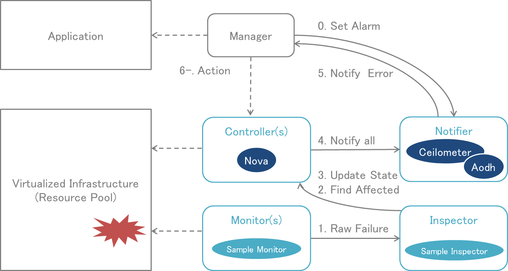

===============
Doctor Platform
===============

https://wiki.opnfv.org/doctor

Features
========

Doctor platform, as of Brahmaputra release, provides the two features:

* Immediate Notification
* Consistent resource state awareness (Compute)

These feafures enable high availability of Network Services on top of
virtualized infrastructure. Immediate notification allows VNF managers
to process recovery actions promptly once failure occurred.
Consistency of resource state is necessary to execute recovery actions
properly in VIM.

Components
==========

Doctor platform, as of Brahmaputra release, consists of the followings:

* OpenStack Compute (Nova)
* OpenStack Telemetry (Ceilometer)
* OpenStack Alarming (Aodh)
* Doctor Inspector
* Doctor Monitor

.. note::
    Doctor Inspector and Monitor are sample implementation for reference.

You can see overview of Doctor palatform and how components interacts in
:numref:`figure-p1`.

   Doctor Platform and Typical Sequence (Brahmaputra)

Detailed architecture of Doctor platform can be found in the Requirements
Documentation,
http://artifacts.opnfv.org/doctor/docs/requirements/05-implementation.html
.
