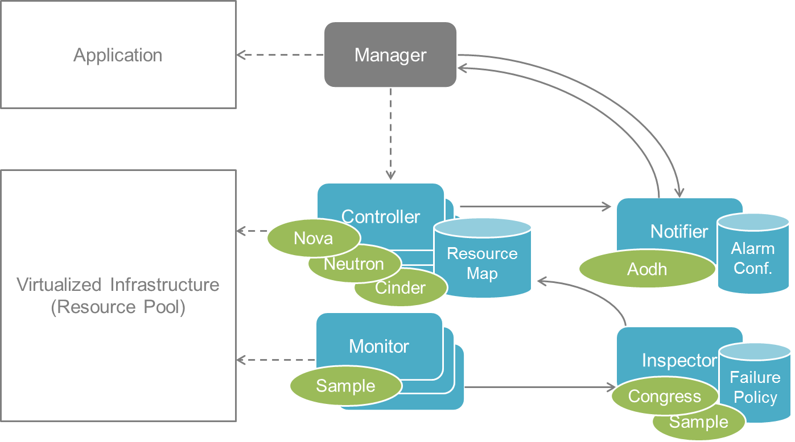

.. This work is licensed under a Creative Commons Attribution 4.0 International License.
.. http://creativecommons.org/licenses/by/4.0

Doctor capabilities and usage
=============================

:numref:`figure1` shows the currently implemented and tested architecture of
Doctor. The implementation is based on OpenStack and related components. The
Monitor can be realized by a sample Python-based implementation provided in the
Doctor code repository. The Controller is realized by OpenStack Nova, Neutron
and Cinder for compute, network and storage, respectively. The Inspector can be
realized by OpenStack Congress, Vitrage or a sample Python-based implementation also
available in the code repository of Doctor. The Notifier is realized by
OpenStack Aodh.

   Implemented and tested architecture

Immediate Notification
----------------------

Immediate notification can be used by creating 'event' type alarm via
OpenStack Alarming (Aodh) API with relevant internal components support.

See:
- Upstream spec document:
https://specs.openstack.org/openstack/ceilometer-specs/specs/liberty/event-alarm-evaluator.html
- Aodh official documentation:
https://docs.openstack.org/aodh/latest

An example of a consumer of this notification can be found in the Doctor
repository. It can be executed as follows:

.. code-block:: bash

    git clone https://gerrit.opnfv.org/gerrit/doctor
    cd doctor/doctor_tests/consumer
    CONSUMER_PORT=12346
    python sample.py "$CONSUMER_PORT" > consumer.log 2>&1 &

Consistent resource state awareness
-----------------------------------

Resource state of compute host can be changed/updated according to a trigger
from a monitor running outside of OpenStack Compute (Nova) by using
force-down API.

See:
* Upstream spec document: https://specs.openstack.org/openstack/nova-specs/specs/liberty/implemented/mark-host-down.html
* Upstream Compute API reference document: https://developer.openstack.org/api-ref/compute
* Doctor Mark Host Down Manual: https://git.opnfv.org/doctor/tree/docs/development/manuals/mark-host-down_manual.rst

Valid compute host status given to VM owner
-------------------------------------------

The resource state of a compute host can be retrieved by a user with the
OpenStack Compute (Nova) servers API.

See:
* Upstream spec document: https://specs.openstack.org/openstack/nova-specs/specs/mitaka/implemented/get-valid-server-state.html
* Upstream Compute API reference document: https://developer.openstack.org/api-ref/compute
* Doctor Get Valid Server State Manual: https://git.opnfv.org/doctor/tree/docs/development/manuals/get-valid-server-state.rst

Port data plane status update
-----------------------------

Port data plane status can be changed/updated in the case of issues in the underlying data plane
affecting connectivity from/to Neutron ports.

See:
* Upstream spec document: https://specs.openstack.org/openstack/neutron-specs/specs/pike/port-data-plane-status.html
* Upstream Networking API reference document: https://developer.openstack.org/api-ref/network

Doctor driver (Congress)
------------------------

The Doctor driver can be notified about NFVI failures that have been detected by monitoring systems.

See:
* Upstream spec document: https://specs.openstack.org/openstack/congress-specs/specs/mitaka/push-type-datasource-driver.html
* Congress official documentation: https://docs.openstack.org/congress/latest

Event API (Vitrage)
-------------------
With this API, monitoring systems can push events to the Doctor datasource.

See:
* Upstream spec document: https://specs.openstack.org/openstack/vitrage-specs/specs/ocata/event-api.html
* Vitrage official documentation: https://docs.openstack.org/vitrage/latest

Doctor datasource (Vitrage)
---------------------------
After receiving events from monitoring systems, the Doctor datasource identifies the affected resources based on the resource topology.

See:
* Upstream spec document: https://specs.openstack.org/openstack/vitrage-specs/specs/ocata/doctor-datasource.html

