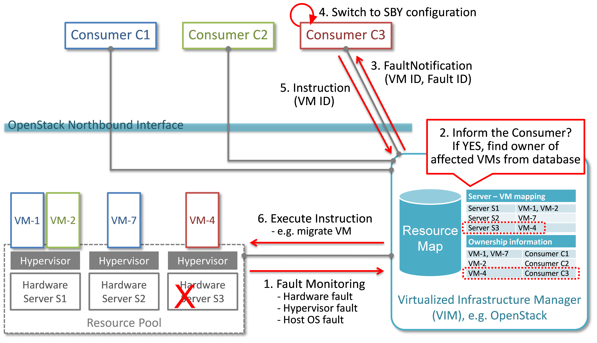
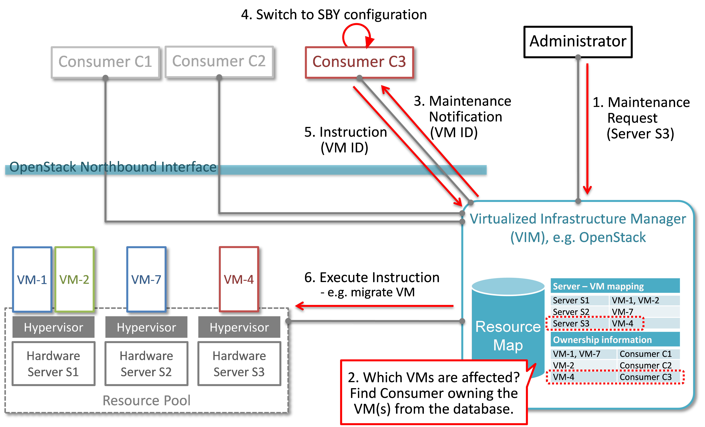

Use cases and scenarios
=======================

Telecom services often have very high requirements on service performance. As a
consequence they often utilize redundancy and high availability (HA) mechanisms
for both the service and the platform. The HA support may be built-in or
provided by the platform. In any case, the HA support typically has a very fast
detection and reaction time to minimize service impact. The main changes
proposed in this document are about making a clear distinction between fault
management and recovery a) within the VIM/NFVI and b) High Availability support
for VNFs on the other, claiming that HA support within a VNF or as a service
from the platform is outside the scope of Doctor and is discussed in the High
Availability for OPNFV project. Doctor should focus on detecting and remediating
faults in the NFVI. This will ensure that applications come back to a fully
redundant configuration faster than before.

As an example, Telecom services can come with an Active-Standby (ACT-STBY)
configuration which is a (1+1) redundancy scheme. ACT and STBY nodes (aka
Physical Network Function (PNF) in ETSI NFV terminology) are in a hot standby
configuration. If an ACT node is unable to function properly due to fault or any
other reason, the STBY node is instantly made ACT, and affected services can be
provided without any service interruption.

The ACT-STBY configuration needs to be maintained. This means, when a STBY node
is made ACT, either the previously ACT node, after recovery, shall be made STBY,
or, a new STBY node needs to be configured. The actual operations to
instantiate/configure a new STBY are similar to instantiating a new VNF and
therefore are outside the scope of this project.

The NFVI fault management and maintenance requirements aim at providing fast
failure detection of physical and virtualized resources and remediation of the
virtualized resources provided to Consumers according to their predefined
request to enable applications to recover to a fully redundant mode of
operation.

1. Fault management/recovery using ACT-STBY configuration (Triggered by critical
   error)
2. Preventive actions based on fault prediction (Preventing service stop by
   handling warnings)
3. VM Retirement (Managing service during NFVI maintenance, i.e. H/W,
   Hypervisor, Host OS, maintenance)

Faults
------

.. _uc-fault1:

Fault management using ACT-STBY configuration
^^^^^^^^^^^^^^^^^^^^^^^^^^^^^^^^^^^^^^^^^^^^^

In :numref:`figure1`, a system-wide view of relevant functional blocks is
presented. OpenStack is considered as the VIM implementation (aka Controller)
which has interfaces with the NFVI and the Consumers. The VNF implementation is
represented as different virtual resources marked by different colors. Consumers
(VNFM or NFVO in ETSI NFV terminology) own/manage the respective virtual
resources (VMs in this example) shown with the same colors.

The first requirement in this use case is that the Controller needs to detect
faults in the NVFI ("1. Fault Notification" in :numref:`figure1`) affecting
the proper functioning of the virtual resources (labelled as VM-x) running on
top of it. It should be possible to configure which relevant fault items should
be detected. The VIM (e.g. OpenStack) itself could be extended to detect such
faults. Alternatively, a third party fault monitoring tool could be used which
then informs the VIM about such faults; this third party fault monitoring
element can be considered as a component of VIM from an architectural point of
view.

Once such fault is detected, the VIM shall find out which virtual resources are
affected by this fault. In the example in :numref:`figure1`, VM-4 is
affected by a fault in the Hardware Server-3. Such mapping shall be maintained
in the VIM, depicted as the "Server-VM info" table inside the VIM.

Once the VIM has identified which virtual resources are affected by the fault,
it needs to find out who is the Consumer (i.e. the owner/manager) of the
affected virtual resources (Step 2). In the example shown in :numref:`figure1`,
the VIM knows that for the red VM-4, the manager is the red Consumer
through an Ownership info table. The VIM then notifies (Step 3 "Fault
Notification") the red Consumer about this fault, preferably with sufficient
abstraction rather than detailed physical fault information.

   Fault management/recovery use case

The Consumer then switches to STBY configuration by switching the STBY node to
ACT state (Step 4). It further initiates a process to instantiate/configure a
new STBY. However, switching to STBY mode and creating a new STBY machine is a
VNFM/NFVO level operation and therefore outside the scope of this project.
Doctor project does not create interfaces for such VNFM level configuration
operations. Yet, since the total failover time of a consumer service depends on
both the delay of such processes as well as the reaction time of Doctor
components, minimizing Doctor's reaction time is a necessary basic ingredient to
fast failover times in general.

Once the Consumer has switched to STBY configuration, it notifies (Step 5
"Instruction" in :numref:`figure1`) the VIM. The VIM can then take
necessary (e.g. pre-determined by the involved network operator) actions on how
to clean up the fault affected VMs (Step 6 "Execute Instruction").

The key issue in this use case is that a VIM (OpenStack in this context) shall
not take a standalone fault recovery action (e.g. migration of the affected VMs)
before the ACT-STBY switching is complete, as that might violate the ACT-STBY
configuration and render the node out of service.

As an extension of the 1+1 ACT-STBY resilience pattern, a STBY instance can act as
backup to N ACT nodes (N+1). In this case, the basic information flow remains
the same, i.e., the consumer is informed of a failure in order to activate the
STBY node. However, in this case it might be useful for the failure notification
to cover a number of failed instances due to the same fault (e.g., more than one
instance might be affected by a switch failure). The reaction of the consumer
might depend on whether only one active instance has failed (similar to the
ACT-STBY case), or if more active instances are needed as well.

Preventive actions based on fault prediction
^^^^^^^^^^^^^^^^^^^^^^^^^^^^^^^^^^^^^^^^^^^^

The fault management scenario explained in :ref:`uc-fault1` can also be
performed based on fault prediction. In such cases, in VIM, there is an
intelligent fault prediction module which, based on its NFVI monitoring
information, can predict an imminent fault in the elements of NFVI.
A simple example is raising temperature of a Hardware Server which might
trigger a pre-emptive recovery action. The requirements of such fault
prediction in the VIM are investigated in the OPNFV project "Data Collection
for Failure Prediction" [PRED]_.

This use case is very similar to :ref:`uc-fault1`. Instead of a fault
detection (Step 1 "Fault Notification in" :numref:`figure1`), the trigger
comes from a fault prediction module in the VIM, or from a third party module
which notifies the VIM about an imminent fault. From Step 2~5, the work flow is
the same as in the "Fault management using ACT-STBY configuration" use case,
except in this case, the Consumer of a VM/VNF switches to STBY configuration
based on a predicted fault, rather than an occurred fault.

NVFI Maintenance
----------------

VM Retirement
^^^^^^^^^^^^^

All network operators perform maintenance of their network infrastructure, both
regularly and irregularly. Besides the hardware, virtualization is expected to
increase the number of elements subject to such maintenance as NFVI holds new
elements like the hypervisor and host OS. Maintenance of a particular resource
element e.g. hardware, hypervisor etc. may render a particular server hardware
unusable until the maintenance procedure is complete.

However, the Consumer of VMs needs to know that such resources will be
unavailable because of NFVI maintenance. The following use case is again to
ensure that the ACT-STBY configuration is not violated. A stand-alone action
(e.g. live migration) from VIM/OpenStack to empty a physical machine so that
consequent maintenance procedure could be performed may not only violate the
ACT-STBY configuration, but also have impact on real-time processing scenarios
where dedicated resources to virtual resources (e.g. VMs) are necessary and a
pause in operation (e.g. vCPU) is not allowed. The Consumer is in a position to
safely perform the switch between ACT and STBY nodes, or switch to an
alternative VNF forwarding graph so the hardware servers hosting the ACT nodes
can be emptied for the upcoming maintenance operation. Once the target hardware
servers are emptied (i.e. no virtual resources are running on top), the VIM can
mark them with an appropriate flag (i.e. "maintenance" state) such that these
servers are not considered for hosting of virtual machines until the maintenance
flag is cleared (i.e. nodes are back in "normal" status).

A high-level view of the maintenance procedure is presented in :numref:`figure2`.
VIM/OpenStack, through its northbound interface, receives a maintenance notification
(Step 1 "Maintenance Request") from the Administrator (e.g. a network operator)
including information about which hardware is subject to maintenance.
Maintenance operations include replacement/upgrade of hardware,
update/upgrade of the hypervisor/host OS, etc.

The consequent steps to enable the Consumer to perform ACT-STBY switching are
very similar to the fault management scenario. From VIM/OpenStack's internal
database, it finds out which virtual resources (VM-x) are running on those
particular Hardware Servers and who are the managers of those virtual resources
(Step 2). The VIM then informs the respective Consumer (VNFMs or NFVO) in Step 3
"Maintenance Notification". Based on this, the Consumer takes necessary actions
(Step 4, e.g. switch to STBY configuration or switch VNF forwarding graphs) and
then notifies (Step 5 "Instruction") the VIM. Upon receiving such notification,
the VIM takes necessary actions (Step 6 "Execute Instruction" to empty the
Hardware Servers so that consequent maintenance operations could be performed.
Due to the similarity for Steps 2~6, the maintenance procedure and the fault
management procedure are investigated in the same project.

   Maintenance use case

..
 vim: set tabstop=4 expandtab textwidth=80:
