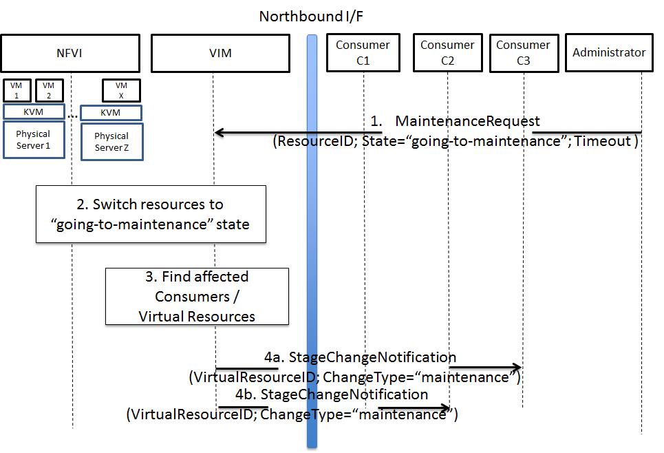
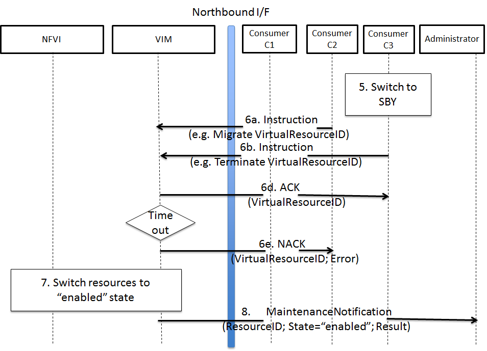

High level architecture and general features
============================================

Functional overview
-------------------

The Doctor project circles around two distinct use cases: 1) management of
failures of virtualized resources and 2) planned maintenance, e.g. migration, of
virtualized resources. Both of them may affect a VNF/application and the network
service it provides, but there is a difference in frequency and how they can be
handled.

Failures are spontaneous events that may or may not have an impact on the
virtual resources. The Consumer should as soon as possible react to the failure,
e.g., by switching to the STBY node. The Consumer will then instruct the VIM on
how to clean up or repair the lost virtual resources, i.e. restore the VM, VLAN
or virtualized storage. How much the applications are affected varies.
Applications with built-in HA support might experience a short decrease in
retainability (e.g. an ongoing session might be lost) while keeping availability
(establishment or re-establishment of sessions are not affected), whereas the
impact on applications without built-in HA may be more serious. How much the
network service is impacted depends on how the service is implemented. With
sufficient network redundancy the service may be unaffected even when a specific
resource fails.

On the other hand, planned maintenance impacting virtualized resources are events
that are known in advance. This group includes e.g. migration due to software
upgrades of OS and hypervisor on a compute host. Some of these might have been
requested by the application or its management solution, but there is also a
need for coordination on the actual operations on the virtual resources. There
may be an impact on the applications and the service, but since they are not
spontaneous events there is room for planning and coordination between the
application management organization and the infrastructure management
organization, including performing whatever actions that would be required to
minimize the problems.

Failure prediction is the process of pro-actively identifying situations that
may lead to a failure in the future unless acted on by means of maintenance
activities. From applications' point of view, failure prediction may impact them
in two ways: either the warning time is so short that the application or its
management solution does not have time to react, in which case it is equal to
the failure scenario, or there is sufficient time to avoid the consequences by
means of maintenance activities, in which case it is similar to planned
maintenance.

Architecture Overview
---------------------

NFV and the Cloud platform provide virtual resources and related control
functionality to users and administrators. :numref:`figure3` shows the high
level architecture of NFV focusing on the NFVI, i.e., the virtualized
infrastructure. The NFVI provides virtual resources, such as virtual machines
(VM) and virtual networks. Those virtual resources are used to run applications,
i.e. VNFs, which could be components of a network service which is managed by
the consumer of the NFVI. The VIM provides functionalities of controlling and
viewing virtual resources on hardware (physical) resources to the consumers,
i.e., users and administrators. OpenStack is a prominent candidate for this VIM.
The administrator may also directly control the NFVI without using the VIM.

Although OpenStack is the target upstream project where the new functional
elements (Controller, Notifier, Monitor, and Inspector) are expected to be
implemented, a particular implementation method is not assumed. Some of these
elements may sit outside of OpenStack and offer a northbound interface to
OpenStack.

General Features and Requirements
---------------------------------

The following features are required for the VIM to achieve high availability of
applications (e.g., MME, S/P-GW) and the Network Services:

1. Monitoring: Monitor physical and virtual resources.
2. Detection: Detect unavailability of physical resources.
3. Correlation and Cognition: Correlate faults and identify affected virtual
   resources.
4. Notification: Notify unavailable virtual resources to their Consumer(s).
5. Fencing: Shut down or isolate a faulty resource.
6. Recovery action: Execute actions to process fault recovery and maintenance.

The time interval between the instant that an event is detected by the
monitoring system and the Consumer notification of unavailable resources shall
be < 1 second (e.g., Step 1 to Step 4 in :numref:`figure4`).

.. figure:: images/figure3.png
   :name: figure3
   :width: 100%

   High level architecture

Monitoring
^^^^^^^^^^

The VIM shall monitor physical and virtual resources for unavailability and
suspicious behavior.

Detection
^^^^^^^^^

The VIM shall detect unavailability and failures of physical resources that
might cause errors/faults in virtual resources running on top of them.
Unavailability of physical resource is detected by various monitoring and
managing tools for hardware and software components. This may include also
predicting upcoming faults. Note, fault prediction is out of scope of this
project and is investigated in the OPNFV "Data Collection for Failure
Prediction" project [PRED]_.

The fault items/events to be detected shall be configurable.

The configuration shall enable Failure Selection and Aggregation. Failure
aggregation means the VIM determines unavailability of physical resource from
more than two non-critical failures related to the same resource.

There are two types of unavailability - immediate and future:

* Immediate unavailability can be detected by setting traps of raw failures on
  hardware monitoring tools.
* Future unavailability can be found by receiving maintenance instructions
  issued by the administrator of the NFVI or by failure prediction mechanisms.

Correlation and Cognition
^^^^^^^^^^^^^^^^^^^^^^^^^

The VIM shall correlate each fault to the impacted virtual resource, i.e., the
VIM shall identify unavailability of virtualized resources that are or will be
affected by failures on the physical resources under them. Unavailability of a
virtualized resource is determined by referring to the mapping of physical and
virtualized resources.

VIM shall allow configuration of fault correlation between physical and
virtual resources. VIM shall support correlating faults:

* between a physical resource and another physical resource
* between a physical resource and a virtual resource
* between a virtual resource and another virtual resource

Failure aggregation is also required in this feature, e.g., a user may request
to be only notified if failures on more than two standby VMs in an (N+M)
deployment model occurred.

Notification
^^^^^^^^^^^^

The VIM shall notify the alarm, i.e., unavailability of virtual resource(s), to
the Consumer owning it over the northbound interface, such that the Consumers
impacted by the failure can take appropriate actions to recover from the
failure.

The VIM shall also notify the unavailability of physical resources to its
Administrator.

All notifications shall be transferred immediately in order to minimize the
stalling time of the network service and to avoid over assignment caused by
delay of capability updates.

There may be multiple consumers, so the VIM has to find out the owner of a
faulty resource. Moreover, there may be a large number of virtual and physical
resources in a real deployment, so polling the state of all resources to the VIM
would lead to heavy signaling traffic. Thus, a publication/subscription
messaging model is better suited for these notifications, as notifications are
only sent to subscribed consumers.

Notifications will be send out along with the configuration by the consumer.
The configuration includes endpoint(s) in which the consumers can specify
multiple targets for the notification subscription, so that various and
multiple receiver functions can consume the notification message.
Also, the conditions for notifications shall be configurable, such that
the consumer can set according policies, e.g. whether it wants to receive
fault notifications or not.

Note: the VIM should only accept notification subscriptions for each resource
by its owner or administrator.
Notifications to the Consumer about the unavailability of virtualized
resources will include a description of the fault, preferably with sufficient
abstraction rather than detailed physical fault information.

.. _fencing:

Fencing
^^^^^^^
Recovery actions, e.g. safe VM evacuation, have to be preceded by fencing the
failed host. Fencing hereby means to isolate or shut down a faulty resource.
Without fencing -- when the perceived disconnection is due to some transient
or partial failure -- the evacuation might lead into two identical instances
running together and having a dangerous conflict.

There is a cross-project definition in OpenStack of how to implement
fencing, but there has not been any progress. The general description is
available here:
https://wiki.openstack.org/wiki/Fencing_Instances_of_an_Unreachable_Host

As OpenStack does not cover fencing it is in the responsibility of the Doctor
project to make sure fencing is done by using tools like pacemaker and by
calling OpenStack APIs. Only after fencing is done OpenStack resources can be
marked as down. In case there are gaps in OpenStack projects to have all
relevant resources marked as down, those gaps need to be identified and fixed.
The Doctor Inspector component will be responsible of marking resources down in
the OpenStack and back up if necessary.

Recovery Action
^^^^^^^^^^^^^^^

In the basic :ref:`uc-fault1` use case, no automatic actions will be taken by
the VIM, but all recovery actions executed by the VIM and the NFVI will be
instructed and coordinated by the Consumer.

In a more advanced use case, the VIM shall be able to recover the failed virtual
resources according to a pre-defined behavior for that resource. In principle
this means that the owner of the resource (i.e., its consumer or administrator)
can define which recovery actions shall be taken by the VIM. Examples are a
restart of the VM, migration/evacuation of the VM, or no action.

High level northbound interface specification
---------------------------------------------

Fault management
^^^^^^^^^^^^^^^^

This interface allows the Consumer to subscribe to fault notification from the
VIM. Using a filter, the Consumer can narrow down which faults should be
notified. A fault notification may trigger the Consumer to switch from ACT to
STBY configuration and initiate fault recovery actions. A fault query
request/response message exchange allows the Consumer to find out about active
alarms at the VIM. A filter can be used to narrow down the alarms returned in
the response message.

.. figure:: images/figure4.png
   :name: figure4
   :width: 100%

   High-level message flow for fault management

The high level message flow for the fault management use case is shown in
:numref:`figure4`.
It consists of the following steps:

1. The VIM monitors the physical and virtual resources and the fault management
   workflow is triggered by a monitored fault event.
2. Event correlation, fault detection and aggregation in VIM. Note: this may
   also happen after Step 3.
3. Database lookup to find the virtual resources affected by the detected fault.
4. Fault notification to Consumer.
5. The Consumer switches to standby configuration (STBY).
6. Instructions to VIM requesting certain actions to be performed on the
   affected resources, for example migrate/update/terminate specific
   resource(s). After reception of such instructions, the VIM is executing the
   requested action, e.g., it will migrate or terminate a virtual resource.

NFVI Maintenance
^^^^^^^^^^^^^^^^

The NFVI maintenance interface allows the Administrator to notify the VIM about
a planned maintenance operation on the NFVI. A maintenance operation may for
example be an update of the server firmware or the hypervisor. The
MaintenanceRequest message contains instructions to change the state of the
physical resource from 'enabled' to 'going-to-maintenance' and a timeout [#timeout]_.
After receiving the MaintenanceRequest,the VIM decides on the actions to be taken
based on maintenance policies predefined by the affected Consumer(s).

.. [#timeout] Timeout is set by the Administrator and corresponds to the maximum time to empty the physical resources.

   High-level message flow for maintenance policy enforcement

The high level message flow for the NFVI maintenance policy enforcement is shown
in :numref:`figure5a`. It consists of the following steps:

1. Maintenance trigger received from Administrator.
2. VIM switches the affected physical resources to "going-to-maintenance" state e.g. so that no new
   VM will be scheduled on the physical servers.
3. Database lookup to find the Consumer(s) and virtual resources affected by the maintenance
   operation.
4. Maintenance policies are enforced in the VIM, e.g. affected VM(s) are shut down
   on the physical server(s), or affected Consumer(s) are notified about the planned
   maintenance operation (steps 4a/4b).

Once the affected Consumer(s) have been notified, they take specific actions (e.g. switch to standby
(STBY) configuration, request to terminate the virtual resource(s)) to allow the maintenance
action to be executed. After the physical resources have been emptied, the VIM puts the physical
resources in "in-maintenance" state and sends a MaintenanceResponse back to the Administrator.

.. figure:: images/figure5b.png
   :name: figure5b
   :width: 100%

   Successful NFVI maintenance

The high level message flow for a successful NFVI maintenance is show in :numref:`figure5b`.
It consists of the following steps:

5. The Consumer C3 switches to standby configuration (STBY).
6. Instructions from Consumers C2/C3 are shared to VIM requesting certain actions to be performed
   (steps 6a, 6b). After receiving such instructions, the VIM executes the requested
   action in order to empty the physical resources (step 6c) and informs the
   Consumer about the result of the actions (steps 6d, 6e).
7. The VIM switches the physical resources to "in-maintenance" state
8. Maintenance response is sent from VIM to inform the Administrator that the physical
   servers have been emptied.
9. The Administrator is coordinating and executing the maintenance
   operation/work on the NFVI. Note: this step is out of scope of Doctor project.

The requested actions to empty the physical resources may not be successful (e.g. migration fails
or takes too long) and in such a case, the VIM puts the physical resources back to 'enabled' and
informs the Administrator about the problem.

   Example of failed NFVI maintenance

An example of a high level message flow to cover the failed NFVI maintenance case is
shown in :numref:`figure5c`.
It consists of the following steps:

5. The Consumer C3 switches to standby configuration (STDBY).
6. Instructions from Consumers C2/C3 are shared to VIM requesting certain actions to be performed (steps 6a, 6b).
   The VIM executes the requested actions and sends back a NACK to consumer C2 (step 6d) as the
   migration of the virtual resource(s) is not completed by the given timeout.
7. The VIM switches the physical resources to "enabled" state.
8. MaintenanceResponse is sent from VIM to inform the Administrator that the maintenance action cannot start.

..
 vim: set tabstop=4 expandtab textwidth=80:

