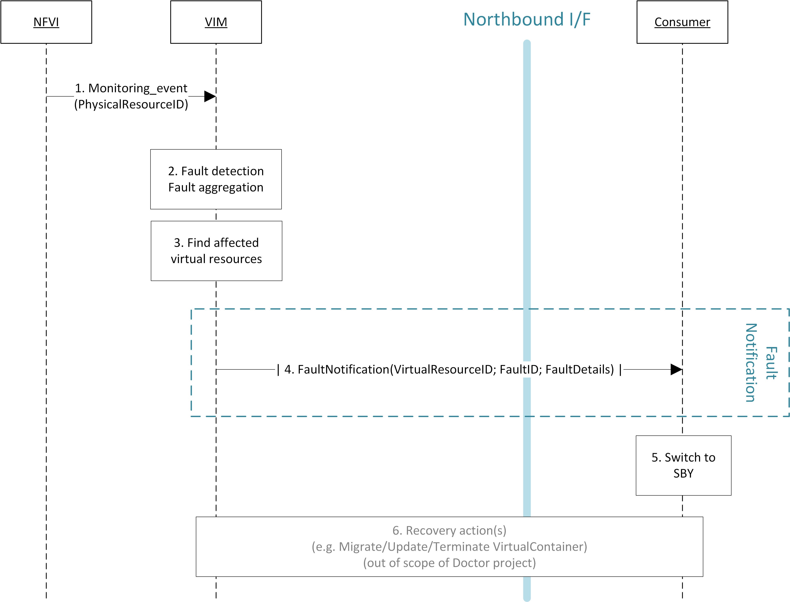

High level architecture and general features
============================================

Functional overview
-------------------

The Doctor project circles around two distinct use cases: 1) management of
failures of virtualized resources and 2) planned maintenance, e.g. migration, of
virtualized resources. Both of them may affect a VNF/application and the network
service it provides, but there is a difference in frequency and how they can be
handled.

Failures are spontaneous events that may or may not have an impact on the
virtual resources. The Consumer should as soon as possible react to the failure,
e.g., by switching to the STBY node. The Consumer will then instruct the VIM on
how to clean up or repair the lost virtual resources, i.e. restore the VM, VLAN
or virtualized storage. How much the applications are affected varies.
Applications with built-in HA support might experience a short decrease in
retainability (e.g. an ongoing session might be lost) while keeping availability
(establishment or re-establishment of sessions are not affected), whereas the
impact on applications without built-in HA may be more serious. How much the
network service is impacted depends on how the service is implemented. With
sufficient network redundancy the service may be unaffected even when a specific
resource fails.

On the other hand, planned maintenance impacting virtualized resources are events
that are known in advance. This group includes e.g. migration due to software
upgrades of OS and hypervisor on a compute host. Some of these might have been
requested by the application or its management solution, but there is also a
need for coordination on the actual operations on the virtual resources. There
may be an impact on the applications and the service, but since they are not
spontaneous events there is room for planning and coordination between the
application management organization and the infrastructure management
organization, including performing whatever actions that would be required to
minimize the problems.

Failure prediction is the process of pro-actively identifying situations that
may lead to a failure in the future unless acted on by means of maintenance
activities. From applications' point of view, failure prediction may impact them
in two ways: either the warning time is so short that the application or its
management solution does not have time to react, in which case it is equal to
the failure scenario, or there is sufficient time to avoid the consequences by
means of maintenance activities, in which case it is similar to planned
maintenance.

Architecture Overview
---------------------

NFV and the Cloud platform provide virtual resources and related control
functionality to users and administrators. :num:`Figure #figure3` shows the high
level architecture of NFV focusing on the NFVI, i.e., the virtualized
infrastructure. The NFVI provides virtual resources, such as virtual machines
(VM) and virtual networks. Those virtual resources are used to run applications,
i.e. VNFs, which could be components of a network service which is managed by
the consumer of the NFVI. The VIM provides functionalities of controlling and
viewing virtual resources on hardware (physical) resources to the consumers,
i.e., users and administrators. OpenStack is a prominent candidate for this VIM.
The administrator may also directly control the NFVI without using the VIM.

Although OpenStack is the target upstream project where the new functional
elements (Controller, Notifier, Monitor, and Inspector) are expected to be
implemented, a particular implementation method is not assumed. Some of these
elements may sit outside of OpenStack and offer a northbound interface to
OpenStack.

General Features and Requirements
---------------------------------

The following features are required for the VIM to achieve high availability of
applications (e.g., MME, S/P-GW) and the Network Services:

* Monitoring: Monitor physical and virtual resources.
* Detection: Detect unavailability of physical resources.
* Correlation and Cognition: Correlate faults and identify affected virtual
  resources.
* Notification: Notify unavailable virtual resources to their Consumer(s).
* Recovery action: Execute actions to process fault recovery and maintenance.

The time interval between the instant that an event is detected by the
monitoring system and the Consumer notification of unavailable resources shall
be < 1 second (e.g., Step 1 to Step 4 in :num:`Figure #figure4` and :num:`Figure
#figure5`).

.. _figure3:

.. figure:: images/figure3.png
   :width: 100%

   High level architecture

Monitoring
^^^^^^^^^^

The VIM shall monitor physical and virtual resources for unavailability and
suspicious behavior.

Detection
^^^^^^^^^

The VIM shall detect unavailability and failures of physical resources that
might cause errors/faults in virtual resources running on top of them.
Unavailability of physical resource is detected by various monitoring and
managing tools for hardware and software components. This may include also
predicting upcoming faults. Note, fault prediction is out of scope of this
project and is investigated in the OPNFV "Data Collection for Failure
Prediction" project [2]_.

The fault items/events to be detected shall be configurable.

The configuration shall enable Failure Selection and Aggregation. Failure
aggregation means the VIM determines unavailability of physical resource from
more than two non-critical failures related to the same resource.

There are two types of unavailability - immediate and future:

* Immediate unavailability can be detected by setting traps of raw failures on
  hardware monitoring tools.
* Future unavailability can be found by receiving maintenance instructions
  issued by the administrator of the NFVI or by failure prediction mechanisms.

Correlation and Cognition
^^^^^^^^^^^^^^^^^^^^^^^^^

The VIM shall correlate each fault to the impacted virtual resource, i.e., the
VIM shall identify unavailability of virtualized resources that are or will be
affected by failures on the physical resources under them. Unavailability of a
virtualized resource is determined by referring to the mapping of physical and
virtualized resources.

The relation from physical resources to virtualized resources shall be
configurable, as the cause of unavailability of virtualized resources can be
different in technologies and policies of deployment.

Failure aggregation is also required in this feature, e.g., a user may request
to be only notified if failures on more than two standby VMs in an (N+M)
deployment model occurred.

Notification
^^^^^^^^^^^^

The VIM shall notify the alarm, i.e., unavailability of virtual resource(s), to
the Consumer owning it over the northbound interface, such that the Consumers
impacted by the failure can take appropriate actions to recover from the
failure.

The VIM shall also notify the unavailability of physical resources to its
Administrator.

All notifications shall be transferred immediately in order to minimize the
stalling time of the network service and to avoid over assignment caused by
delay of capability updates.

There may be multiple consumers, so the VIM has to find out the owner of a
faulty resource. Moreover, there may be a large number of virtual and physical
resources in a real deployment, so polling the state of all resources to the VIM
would lead to heavy signaling traffic. Thus, a publication/subscription
messaging model is better suited for these notifications, as notifications are
only sent to subscribed consumers.

Note: the VIM should only accept individual notification URLs for each resource
by its owner or administrator.

Notifications to the Consumer about the unavailability of virtualized
resources will include a description of the fault, preferably with sufficient
abstraction rather than detailed physical fault information. Flexibility in
notifications is important. For example, the receiver function in the
consumer-side implementation could have different schema, location, and policies
(e.g. receive or not, aggregate events with the same cause, etc.).

Recovery Action
^^^^^^^^^^^^^^^

In the basic "Fault management using ACT-STBY configuration" use case, no
automatic actions will be taken by the VIM, but all recovery actions executed by
the VIM and the NFVI will be instructed and coordinated by the Consumer.

In a more advanced use case, the VIM shall be able to recover the failed virtual 
resources according to a pre-defined behavior for that resource. In principle
this means that the owner of the resource (i.e., its consumer or administrator)
can define which recovery actions shall be taken by the VIM. Examples are a
restart of the VM, migration/evacuation of the VM, or no action.

High level northbound interface specification
---------------------------------------------

Fault management
^^^^^^^^^^^^^^^^

This interface allows the Consumer to subscribe to fault notification from the
VIM. Using a filter, the Consumer can narrow down which faults should be
notified. A fault notification may trigger the Consumer to switch from ACT to
STBY configuration and initiate fault recovery actions. A fault query
request/response message exchange allows the Consumer to find out about active
alarms at the VIM. A filter can be used to narrow down the alarms returned in
the response message.

.. _figure4:

   High-level message flow for fault management

The high level message flow for the fault management use case is shown in
:num:`Figure #figure4`.
It consists of the following steps:

1. The VIM monitors the physical and virtual resources and the fault management
   workflow is triggered by a monitored fault event.
2. Event correlation, fault detection and aggregation in VIM. Note: this may
   also happen after Step 3.
3. Database lookup to find the virtual resources affected by the detected fault.
4. Fault notification to Consumer.
5. The Consumer switches to standby configuration (STBY)
6. Instructions to VIM requesting certain actions to be performed on the
   affected resources, for example migrate/update/terminate specific
   resource(s). After reception of such instructions, the VIM is executing the
   requested action, e.g., it will migrate or terminate a virtual resource.

NFVI Maintenance
^^^^^^^^^^^^^^^^

The NFVI maintenance interface allows the Administrator to notify the VIM about
a planned maintenance operation on the NFVI. A maintenance operation may for
example be an update of the server firmware or the hypervisor. The
MaintenanceRequest message contains instructions to change the state of the
resource from 'normal' to 'maintenance'. After receiving the MaintenanceRequest,
the VIM will notify the Consumer about the planned maintenance operation,
whereupon the Consumer will switch to standby (STBY) configuration to allow the
maintenance action to be executed. After the request was executed successfully
(i.e., the physical resources have been emptied) or the operation resulted in an
error state, the VIM sends a MaintenanceResponse message back to the
Administrator.

.. _figure5:

   High-level message flow for NFVI maintenance

The high level message flow for the NFVI maintenance use case is shown in
:num:`Figure #figure5`.
It consists of the following steps:

1. Maintenance trigger received from administrator.
2. VIM switches the affected NFVI resources to "maintenance" state, i.e., the
   NFVI resources are prepared for the maintenance operation. For example, the
   virtual resources should not be used for further allocation/migration
   requests and the VIM will coordinate with the Consumer on how to best empty
   the physical resources.
3. Database lookup to find the virtual resources affected by the detected
   maintenance operation.
4. StateChange notification to inform Consumer about planned maintenance
   operation.
5. The Consumer switches to standby configuration (STBY)
6. Instructions from Consumer to VIM requesting certain actions to be performed
   (step 6a). After receiving such instructions, the VIM executes the requested
   action in order to empty the physical resources (step 6b) and informs the
   Consumer is about the result of the actions. Note: this step is out of scope
   of Doctor.
7. Maintenance response from VIM to inform the Administrator that the physical
   machines have been emptied (or the operation resulted in an error state).
8. The Administrator is coordinating and executing the maintenance
   operation/work on the NFVI. Note: this step is out of scope of Doctor.

Faults
------

Faults in the listed elements need to be immediately notified to the Consumer in
order to perform an immediate action like live migration or switch to a hot
standby entity. In addition, the Administrator of the host should trigger a
maintenance action to, e.g., reboot the server or replace a defective hardware
element.

Faults can be of different severity, i.e., critical, warning, or
info. Critical faults require immediate action as a severe degradation of the
system has happened or is expected. Warnings indicate that the system
performance is going down: related actions include closer (e.g. more frequent)
monitoring of that part of the system or preparation for a cold migration to a
backup VM. Info messages do not require any action. We also consider a type
"maintenance", which is no real fault, but may trigger maintenance actions
like a re-boot of the server or replacement of a faulty, but redundant HW.

Faults can be gathered by, e.g., enabling SNMP and installing some open source
tools to catch and poll SNMP. When using for example Zabbix one can also put an
agent running on the hosts to catch any other fault. In any case of failure, the
Administrator should be notified. Table 1 provides a list of high level faults
that are considered within the scope of the Doctor project requiring immediate
action by the Consumer.

+------------------+---------------------------------------------------------------------------------------------------------------------------+------------------+-------------------+------------------------------------------------------------------------------------------+----------------------------------------------------------------------+
| Service          | Fault                                                                                                                     | Severity         | How to detect?    | Comment                                                                                  | Action to recover                                                    |
+------------------+---------------------------------------------------------------------------------------------------------------------------+------------------+-------------------+------------------------------------------------------------------------------------------+----------------------------------------------------------------------+
| Compute Hardware | Processor/CPU failure, CPU condition not ok                                                                               | Critical         | Zabbix            |                                                                                          | Switch to hot standby                                                |
+                  +---------------------------------------------------------------------------------------------------------------------------+------------------+-------------------+------------------------------------------------------------------------------------------+----------------------------------------------------------------------+
|                  | Memory failure/Memory condition not ok                                                                                    | Critical         | Zabbix (IPMI)     |                                                                                          | Switch to hot standby                                                |
+                  +---------------------------------------------------------------------------------------------------------------------------+------------------+-------------------+------------------------------------------------------------------------------------------+----------------------------------------------------------------------+
|                  | Network card failure, e.g. network adapter connectivity lost                                                              | Critical         | Zabbix/Ceilometer |                                                                                          | Switch to hot standby                                                |
+                  +---------------------------------------------------------------------------------------------------------------------------+------------------+-------------------+------------------------------------------------------------------------------------------+----------------------------------------------------------------------+
|                  | Disk crash                                                                                                                | Info             | RAID monitoring   | Network storage is very redundant (e.g. RAID system) and can guarantee high availability | Inform OAM                                                           |
+                  +---------------------------------------------------------------------------------------------------------------------------+------------------+-------------------+------------------------------------------------------------------------------------------+----------------------------------------------------------------------+
|                  | Storage controller                                                                                                        | Critical         | Zabbix (IPMI)     |                                                                                          | Live migration if storage is still accessible; otherwise hot standby |
+                  +---------------------------------------------------------------------------------------------------------------------------+------------------+-------------------+------------------------------------------------------------------------------------------+----------------------------------------------------------------------+
|                  | PDU/power failure, power off, server reset                                                                                | Critical         | Zabbix/Ceilometer |                                                                                          | Switch to hot standby                                                |
+                  +---------------------------------------------------------------------------------------------------------------------------+------------------+-------------------+------------------------------------------------------------------------------------------+----------------------------------------------------------------------+
|                  | Power degradation, power redundancy lost, power threshold exceeded                                                        | Warning          | SNMP              |                                                                                          | Live migration                                                       |
+                  +---------------------------------------------------------------------------------------------------------------------------+------------------+-------------------+------------------------------------------------------------------------------------------+----------------------------------------------------------------------+
|                  | Chassis problem (.e.g fan degraded/failed, chassis power degraded), CPU fan problem, temperature/thermal condition not ok | Warning          | SNMP              |                                                                                          | Live migration                                                       |
+                  +---------------------------------------------------------------------------------------------------------------------------+------------------+-------------------+------------------------------------------------------------------------------------------+----------------------------------------------------------------------+
|                  | Mainboard failure                                                                                                         | Critical         | Zabbix (IPMI)     |                                                                                          | Switch to hot standby                                                |
+                  +---------------------------------------------------------------------------------------------------------------------------+------------------+-------------------+------------------------------------------------------------------------------------------+----------------------------------------------------------------------+
|                  | OS crash (e.g. kernel panic)                                                                                              | Critical         | Zabbix            |                                                                                          | Switch to hot standby                                                |
+------------------+---------------------------------------------------------------------------------------------------------------------------+------------------+-------------------+------------------------------------------------------------------------------------------+----------------------------------------------------------------------+
| Hypervisor       | System has restarted                                                                                                      | Critical         | Zabbix            |                                                                                          | Switch to hot standby                                                |
+                  +---------------------------------------------------------------------------------------------------------------------------+------------------+-------------------+------------------------------------------------------------------------------------------+----------------------------------------------------------------------+
|                  | Hypervisor failure                                                                                                        | Warning/Critical | Zabbix/Ceilometer |                                                                                          | Evacuation/switch to hot standby                                     |
+                  +---------------------------------------------------------------------------------------------------------------------------+------------------+-------------------+------------------------------------------------------------------------------------------+----------------------------------------------------------------------+
|                  | Zabbix/Ceilometer is unreachable                                                                                          | Warning          | ?                 |                                                                                          | Live migration                                                       |
+------------------+---------------------------------------------------------------------------------------------------------------------------+------------------+-------------------+------------------------------------------------------------------------------------------+----------------------------------------------------------------------+
| Network          | SDN/OpenFlow switch, controller degraded/failed                                                                           | Critical         | ?                 |                                                                                          | Switch to hot standby or reconfigure virtual network topology        |
+                  +---------------------------------------------------------------------------------------------------------------------------+------------------+-------------------+------------------------------------------------------------------------------------------+----------------------------------------------------------------------+
|                  | Hardware failure of physical switch/router                                                                                | Warning          | SNMP              | Redundancy of physical infrastructure is reduced or no longer available                  | Live migration if possible, otherwise evacuation                     |
+------------------+---------------------------------------------------------------------------------------------------------------------------+------------------+-------------------+------------------------------------------------------------------------------------------+----------------------------------------------------------------------+

..
 vim: set tabstop=4 expandtab textwidth=80:
