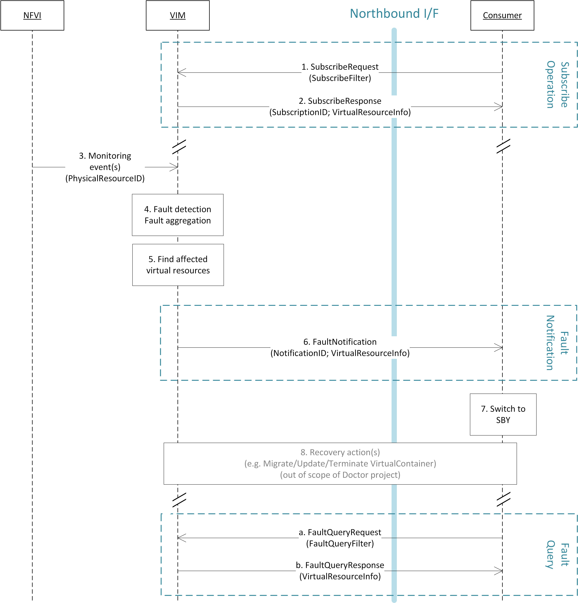
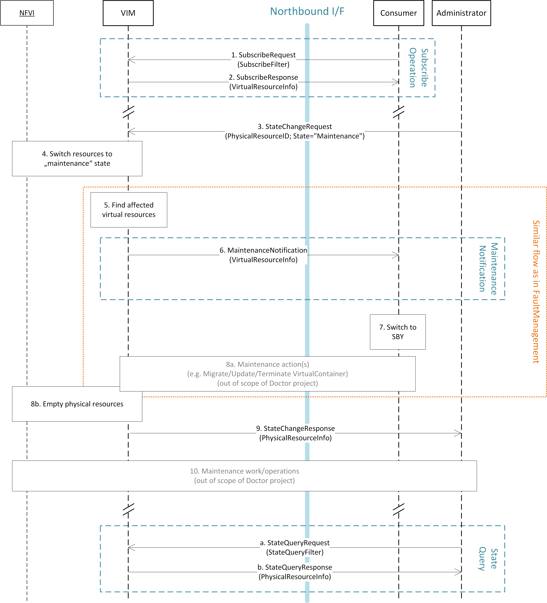
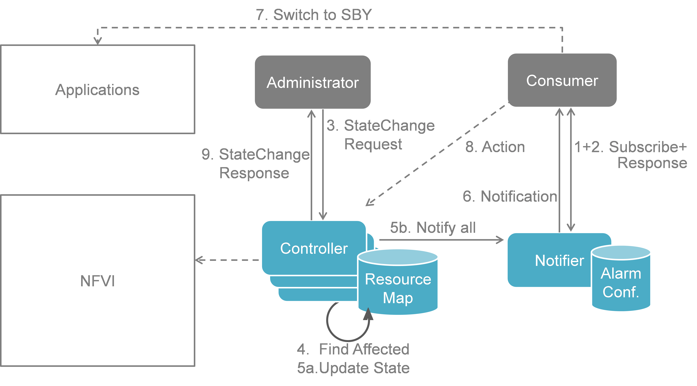

Detailed implementation plan
============================

This section describes a detailed implementation plan, which is based on the
high level architecture introduced in Section 3. Section 5.1 describes the
functional blocks of the Doctor architecture, which is followed by a high level
message flow in Section 5.2. Section 5.3 provides a mapping of selected existing
open source components to the building blocks of the Doctor architecture.
Thereby, the selection of components is based on their maturity and the gap
analysis executed in Section 4. Sections 5.4 and 5.5 detail the specification of
the related northbound interface and the related information elements. Finally,
Section 5.6 provides a first set of blueprints to address selected gaps required
for the realization functionalities of the Doctor project.

Functional Blocks
-----------------

This section introduces the functional blocks to form the VIM. OpenStack was
selected as the candidate for implementation. Inside the VIM, 4 different
building blocks are defined (see :num:`Figure #figure6`).

.. _figure6:

   Functional blocks

Monitor
^^^^^^^

The Monitor module has the responsibility for monitoring the virtualized
infrastructure. There are already many existing tools and services (e.g. Zabbix)
to monitor different aspects of hardware and software resources which can be
used for this purpose.

Inspector
^^^^^^^^^

The Inspector module has the ability a) to receive various failure notifications
regarding physical resource(s) from Monitor module(s), b) to find the affected
virtual resource(s) by querying the resource map in the Controller, and c) to
update the state of the virtual resource (and physical resource).

The Inspector has drivers for different types of events and resources to
integrate any type of Monitor and Controller modules. It also uses a failure
policy database to decide on the failure selection and aggregation from raw
events. This failure policy database is configured by the Administrator.

The reason for separation of the Inspector and Controller modules is to make the
Controller focus on simple operations by avoiding a tight integration of various
health check mechanisms into the Controller.

Controller
^^^^^^^^^^

The Controller is responsible for maintaining the resource map (i.e. the mapping
from physical resources to virtual resources), accepting update requests for the
resource state(s) (exposing as provider API), and sending all failure events
regarding virtual resources to the Notifier. Optionally, the Controller has the
ability to poison the state of virtual resources mapping to physical resources
for which it has received failure notifications from the Inspector. The
Controller also re-calculates the capacity of the NVFI when receiving a failure
notification for a physical resource.

In a real-world deployment, the VIM may have several controllers, one for each
resource type, such as Nova, Neutron and Cinder in OpenStack. Each controller
maintains a database of virtual and physical resources which shall be the master
source for resource information inside the VIM.

Notifier
^^^^^^^^

The focus of the Notifier is on selecting and aggregating failure events
received from the controller based on policies mandated by the Consumer.
Therefore, it allows the Consumer to subscribe for alarms regarding virtual
resources using a method such as API endpoint. After receiving a fault
event from a Controller, it will notify the fault to the Consumer by referring
to the alarm configuration which was defined by the Consumer earlier on.

To reduce complexity of the Controller, it is a good approach for the
Controllers to emit all notifications without any filtering mechanism and have
another service (i.e. Notifier) handle those notifications properly. This is the
general philosophy of notifications in OpenStack. Note that a fault message
consumed by the Notifier is different from the fault message received by the
Inspector; the former message is related to virtual resources which are visible
to users with relevant ownership, whereas the latter is related to raw devices
or small entities which should be handled with an administrator privilege.

The northbound interface between the Notifier and the Consumer/Administrator is
specified in Section 5.5.

Sequence
--------

Fault Management
^^^^^^^^^^^^^^^^

The detailed work flow for fault management is as follows (see also :num:`Figure
#figure7`):

1. Request to subscribe to monitor specific virtual resources. A query filter
   can be used to narrow down the alarms the Consumer wants to be informed
   about.
2. Each subscription request is acknowledged with a subscribe response message.
   The response message contains information about the subscribed virtual
   resources, in particular if a subscribed virtual resource is in "alarm"
   state.
3. The NFVI sends monitoring events for resources the VIM has been subscribed
   to. Note: this subscription message exchange between the VIM and NFVI is not
   shown in this message flow.
4. Event correlation, fault detection and aggregation in VIM.
5. Database lookup to find the virtual resources affected by the detected fault.
6. Fault notification to Consumer.
7. The Consumer switches to standby configuration (STBY)
8. Instructions to VIM requesting certain actions to be performed on the
   affected resources, for example migrate/update/terminate specific
   resource(s). After reception of such instructions, the VIM is executing the
   requested action, e.g. it will migrate or terminate a virtual resource.

   a. Query request from Consumer to VIM to get information about the current
   status of a resource.
   b. Response to the query request with information about the current status of
   the queried resource. In case the resource is in "fault" state, information
   about the related fault(s) is returned.

In order to allow for quick reaction to failures, the time interval between
fault detection in step 3 and the corresponding recovery actions in step 7 and 8
shall be less than 1 second.

.. _figure7:

   Fault management work flow

.. _figure8:

.. figure:: images/figure8.png
   :width: 100%

   Fault management scenario

:num:`Figure #figure8` shows a more detailed message flow (Steps 4 to 6) between
the 4 building blocks introduced in Section 5.1.

4. The Monitor observed a fault in the NFVI and reports the raw fault to the
   Inspector.
   The Inspector filters and aggregates the faults using pre-configured
   failure policies.

5.
   a) The Inspector queries the Resource Map to find the virtual resources
   affected by the raw fault in the NFVI.
   b) The Inspector updates the state of the affected virtual resources in the
   Resource Map.
   c) The Controller observes a change of the virtual resource state and informs
   the Notifier about the state change and the related alarm(s).
   Alternatively, the Inspector may directly inform the Notifier about it.

6. The Notifier is performing another filtering and aggregation of the changes
   and alarms based on the pre-configured alarm configuration. Finally, a fault
   notification is sent to northbound to the Consumer.

NFVI Maintenance
^^^^^^^^^^^^^^^^

The detailed work flow for NFVI maintenance is shown in :num:`Figure #figure9`
and has the following steps. Note that steps 1, 2, and 5 to 8a in the NFVI
maintenance work flow are very similar to the steps in the fault management work
flow and share a similar implementation plan in Release 1.

1. Subscribe to fault/maintenance notifications.
2. Response to subscribe request.
3. Maintenance trigger received from administrator.
4. VIM switches NFVI resources to "maintenance" state. This, e.g., means they
   should not be used for further allocation/migration requests
5. Database lookup to find the virtual resources affected by the detected
   maintenance operation.
6. Maintenance notification to Consumer.
7. The Consumer switches to standby configuration (STBY)
8. Instructions from Consumer to VIM requesting certain recovery actions to be
   performed (step 7a). After reception of such instructions, the VIM is
   executing the requested action in order to empty the physical resources (step
   7b).
9. Maintenance response from VIM to inform the Administrator that the physical
   machines have been emptied (or the operation resulted in an error state).
10. Administrator is coordinating and executing the maintenance operation/work
    on the NFVI.

    A) Query request from Administrator to VIM to get information about the
    current state of a resource.
    B) Response to the query request with information about the current state of
    the queried resource(s). In case the resource is in "maintenance" state,
    information about the related maintenance operation is returned.

.. _figure9:

   NFVI maintenance work flow

.. _figure10:

   NFVI Maintenance implementation plan

:num:`Figure #figure10` shows a more detailed message flow (Steps 4 to 6)
between the 4 building blocks introduced in Section 5.1..

3. The Administrator is sending a StateChange request to the Controller residing
   in the VIM.
4. The Controller queries the Resource Map to find the virtual resources
   affected by the planned maintenance operation.
5.

  a) The Controller updates the state of the affected virtual resources in the
  Resource Map database.

  b) The Controller informs the Notifier about the virtual resources that will
  be affected by the maintenance operation.

6. A maintenance notification is sent to northbound to the Consumer.

...

9. The Controller informs the Administrator after the physical resources have
   been freed.

Implementation plan for OPNFV Release 1
---------------------------------------

Fault management
^^^^^^^^^^^^^^^^

:num:`Figure #figure11` shows the implementation plan based on OpenStack and
related components as planned for Release 1. Hereby, the Monitor can be realized
by Zabbix. The Controller is realized by OpenStack Nova [NOVA]_, Neutron
[NEUT]_, and Cinder [CIND]_ for compute, network, and storage,
respectively. The Inspector can be realized by Monasca [MONA]_ or a simple
script querying Nova in order to map between physical and virtual resources. The
Notifier will be realized by Ceilometer [CEIL]_ receiving failure events
on its notification bus.

:num:`Figure #figure12` shows the inner-workings of Ceilometer. After receiving
an "event" on its notification bus, first a notification agent will grab the
event and send a "notification" to the Collector. The collector writes the
notifications received to the Ceilometer databases.

In the existing Ceilometer implementation, an alarm evaluator is periodically
polling those databases through the APIs provided. If it finds new alarms, it
will evaluate them based on the pre-defined alarm configuration, and depending
on the configuration, it will hand a message to the Alarm Notifier, which in
turn will send the alarm message northbound to the Consumer. :num:`Figure
#figure12` also shows an optimized work flow for Ceilometer with the goal to
reduce the delay for fault notifications to the Consumer. The approach is to
implement a new notification agent (called "publisher" in Ceilometer
terminology) which is directly sending the alarm through the "Notification Bus"
to a new "Notification-driven Alarm Evaluator (NAE)" (see Sections 5.6.2 and
5.6.3), thereby bypassing the Collector and avoiding the additional delay of the
existing polling-based alarm evaluator. The NAE is similar to the OpenStack
"Alarm Evaluator", but is triggered by incoming notifications instead of
periodically polling the OpenStack "Alarms" database for new alarms. The
Ceilometer "Alarms" database can hold three states: "normal", "insufficient
data", and "fired". It is representing a persistent alarm database. In order to
realize the Doctor requirements, we need to define new "meters" in the database
(see Section 5.6.1).

.. _figure11:

   Implementation plan in OpenStack (OPNFV Release 1 ”Arno”)

.. _figure12:

   Implementation plan in Ceilometer architecture

NFVI Maintenance
^^^^^^^^^^^^^^^^

For NFVI Maintenance, a quite similar implementation plan exists. Instead of a
raw fault being observed by the Monitor, the Administrator is sending a
Maintenance Request through the northbound interface towards the Controller
residing in the VIM. Similar to the Fault Management use case, the Controller
(in our case OpenStack Nova) will send a maintenance event to the Notifier (i.e.
Ceilometer in our implementation). Within Ceilometer, the same workflow as
described in the previous section applies. In addition, the Controller(s) will
take appropriate actions to evacuate the physical machines in order to prepare
them for the planned maintenance operation. After the physical machines are
emptied, the Controller will inform the Administrator that it can initiate the
maintenance.

Information elements
--------------------

This section introduces all attributes and information elements used in the
messages exchange on the northbound interfaces between the VIM and the VNFO and
VNFM.

Note: The information elements will be aligned with current work in ETSI NFV IFA
working group.

Simple information elements:

* SubscriptionID: identifies a subscription to receive fault or maintenance
  notifications.
* NotificationID: identifies a fault or maintenance notification.
* VirtualResourceID (Identifier): identifies a virtual resource affected by a
  fault or a maintenance action of the underlying physical resource.
* PhysicalResourceID (Identifier): identifies a physical resource affected by a
  fault or maintenance action.
* VirtualResourceState (String): state of a virtual resource, e.g. "normal",
  "maintenance", "down", "error".
* PhysicalResourceState (String): state of a physical resource, e.g. "normal",
  "maintenance", "down", "error".
* VirtualResourceType (String): type of the virtual resource, e.g. "virtual
  machine", "virtual memory", "virtual storage", "virtual CPU", or "virtual
  NIC".
* FaultID (Identifier): identifies the related fault in the underlying physical
  resource. This can be used to correlate different fault notifications caused
  by the same fault in the physical resource.
* FaultType (String): Type of the fault. The allowed values for this parameter
  depend on the type of the related physical resource. For example, a resource
  of type "compute hardware" may have faults of type "CPU failure", "memory
  failure", "network card failure", etc.
* Severity (Integer): value expressing the severity of the fault. The higher the
  value, the more severe the fault.
* MinSeverity (Integer): value used in filter information elements. Only faults
  with a severity higher than the MinSeverity value will be notified to the
  Consumer.
* EventTime (Datetime): Time when the fault was observed.
* EventStartTime and EventEndTime (Datetime): Datetime range that can be used in
  a FaultQueryFilter to narrow down the faults to be queried.
* ProbableCause: information about the probable cause of the fault.
* CorrelatedFaultID (Integer): list of other faults correlated to this fault.
* isRootCause (Boolean): Parameter indicating if this fault is the root for
  other correlated faults. If TRUE, then the faults listed in the parameter
  CorrelatedFaultID are caused by this fault.
* FaultDetails (Key-value pair): provides additional information about the
  fault, e.g. information about the threshold, monitored attributes, indication
  of the trend of the monitored parameter.
* FirmwareVersion (String): current version of the firmware of a physical
  resource.
* HypervisorVersion (String): current version of a hypervisor.
* ZoneID (Identifier): Identifier of the resource zone. A resource zone is the
  logical separation of physical and software resources in an NFVI deployment
  for physical isolation, redundancy, or administrative designation.
* Metadata (Key-Value-Pairs): provides additional information of a physical
  resource in maintenance/error state.

Complex information elements (see also UML diagrams in :num:`Figure #figure13`
and :num:`Figure #figure14`):

* VirtualResourceInfoClass:

  + VirtualResourceID [1] (Identifier)
  + VirtualResourceState [1] (String)
  + Faults [0..*] (FaultClass): For each resource, all faults
    including detailed information about the faults are provided.

* FaultClass: The parameters of the FaultClass are partially based on ETSI TS
  132 111-2 (V12.1.0) [*]_, which is specifying fault management in 3GPP, in
  particular describing the information elements used for alarm notifications.

  - FaultID [1] (Identifier)
  - FaultType [1]
  - Severity [1] (Integer)
  - EventTime [1] (Datetime)
  - ProbableCause [1]
  - CorrelatedFaultID [0..*] (Identifier)
  - FaultDetails [0..*] (Key-value pair)

.. [*] http://www.etsi.org/deliver/etsi_ts/132100_132199/13211102/12.01.00_60/ts_13211102v120100p.pdf

* SubscribeFilterClass

  - VirtualResourceType [0..*] (String)
  - VirtualResourceID [0..*] (Identifier)
  - FaultType [0..*] (String)
  - MinSeverity [0..1] (Integer)

* FaultQueryFilterClass: narrows down the FaultQueryRequest, for example it
  limits the query to certain physical resources, a certain zone, a given fault
  type/severity/cause, or a specific FaultID.

  - VirtualResourceType [0..*] (String)
  - VirtualResourceID [0..*] (Identifier)
  - FaultType [0..*] (String)
  - MinSeverity [0..1] (Integer)
  - EventStartTime [0..1] (Datetime)
  - EventEndTime [0..1] (Datetime)

* PhysicalResourceStateClass:

  - PhysicalResourceID [1] (Identifier)
  - PhysicalResourceState [1] (String): mandates the new state of the physical
    resource.

* PhysicalResourceInfoClass:

  - PhysicalResourceID [1] (Identifier)
  - PhysicalResourceState [1] (String)
  - FirmwareVersion [0..1] (String)
  - HypervisorVersion [0..1] (String)
  - ZoneID [0..1] (Identifier)

* StateQueryFilterClass: narrows down a StateQueryRequest, for example it limits
  the query to certain physical resources, a certain zone, or a given resource
  state (e.g., only resources in "maintenance" state).

  - PhysicalResourceID [1] (Identifier)
  - PhysicalResourceState [1] (String)
  - ZoneID [0..1] (Identifier)

Detailed northbound interface specification
-------------------------------------------

This section is specifying the northbound interfaces for fault management and
NFVI maintenance between the VIM on the one end and the Consumer and the
Administrator on the other ends. For each interface all messages and related
information elements are provided.

Note: The interface definition will be aligned with current work in ETSI NFV IFA
working group .

All of the interfaces described below are produced by the VIM and consumed by
the Consumer or Administrator.

Fault management interface
^^^^^^^^^^^^^^^^^^^^^^^^^^

This interface allows the VIM to notify the Consumer about a virtual resource
that is affected by a fault, either within the virtual resource itself or by the
underlying virtualization infrastructure. The messages on this interface are
shown in :num:`Figure #figure13` and explained in detail in the following
subsections.

Note: The information elements used in this section are described in detail in
Section 5.4.

.. _figure13:

.. figure:: images/figure13.png
   :width: 100%

   Fault management NB I/F messages

SubscribeRequest (Consumer -> VIM)
__________________________________

Subscription from Consumer to VIM to be notified about faults of specific
resources. The faults to be notified about can be narrowed down using a
subscribe filter.

Parameters:

- SubscribeFilter [1] (SubscribeFilterClass): Optional information to narrow
  down the faults that shall be notified to the Consumer, for example limit to
  specific VirtualResourceID(s), severity, or cause of the alarm.

SubscribeResponse (VIM -> Consumer)
___________________________________

Response to a subscribe request message including information about the
subscribed resources, in particular if they are in "fault/error" state.

Parameters:

* SubscriptionID [1] (Identifier): Unique identifier for the subscription. It
  can be used to delete or update the subscription.
* VirtualResourceInfo [0..*] (VirtualResourceInfoClass): Provides additional
  information about the subscribed resources, i.e., a list of the related
  resources, the current state of the resources, etc.

FaultNotification (VIM -> Consumer)
___________________________________

Notification about a virtual resource that is affected by a fault, either within
the virtual resource itself or by the underlying virtualization infrastructure.
After reception of this request, the Consumer will decide on the optimal
action to resolve the fault. This includes actions like switching to a hot
standby virtual resource, migration of the fault virtual resource to another
physical machine, termination of the faulty virtual resource and instantiation
of a new virtual resource in order to provide a new hot standby resource.
Existing resource management interfaces and messages between the Consumer and
the VIM can be used for those actions, and there is no need to define additional
actions on the Fault Management Interface.

Parameters:

* NotificationID [1] (Identifier): Unique identifier for the notification.
* VirtualResourceInfo [1..*] (VirtualResourceInfoClass): List of faulty
  resources with detailed information about the faults.

FaultQueryRequest (Consumer -> VIM)
___________________________________

Request to find out about active alarms at the VIM. A FaultQueryFilter can be
used to narrow down the alarms returned in the response message.

Parameters:

* FaultQueryFilter [1] (FaultQueryFilterClass): narrows down the
  FaultQueryRequest, for example it limits the query to certain physical
  resources, a certain zone, a given fault type/severity/cause, or a specific
  FaultID.

FaultQueryResponse (VIM -> Consumer)
____________________________________

List of active alarms at the VIM matching the FaultQueryFilter specified in the
FaultQueryRequest.

Parameters:

* VirtualResourceInfo [0..*] (VirtualResourceInfoClass): List of faulty
  resources. For each resource all faults including detailed information about
  the faults are provided.

NFVI maintenance
^^^^^^^^^^^^^^^^

The NFVI maintenance interfaces Consumer-VIM allows the Consumer to subscribe to
maintenance notifications provided by the VIM. The related maintenance interface
Administrator-VIM allows the Administrator to issue maintenance requests to the
VIM, i.e. requesting the VIM to take appropriate actions to empty physical
machine(s) in order to execute maintenance operations on them. The interface
also allows the Administrator to query the state of physical machines, e.g., in
order to get details in the current status of the maintenance operation like a
firmware update.

The messages defined in these northbound interfaces are shown in :num:`Figure
#figure14` and described in detail in the following subsections.

.. _figure14:

.. figure:: images/figure14.png
   :width: 100%

   NFVI maintenance NB I/F messages

SubscribeRequest (Consumer -> VIM)
__________________________________

Subscription from Consumer to VIM to be notified about maintenance operations
for specific virtual resources. The resources to be informed about can be
narrowed down using a subscribe filter.

Parameters:

* SubscribeFilter [1] (SubscribeFilterClass): Information to narrow down the
  faults that shall be notified to the Consumer, for example limit to specific
  virtual resource type(s).

SubscribeResponse (VIM -> Consumer)
___________________________________

Response to a subscribe request message, including information about the
subscribed virtual resources, in particular if they are in "maintenance" state.

Parameters:

* SubscriptionID [1] (Identifier): Unique identifier for the subscription. It
  can be used to delete or update the subscription.
* VirtualResourceInfo [0..*] (VirtalResourceInfoClass): Provides additional
  information about the subscribed virtual resource(s), e.g., the ID, type and
  current state of the resource(s).

MaintenanceNotification (VIM -> Consumer)
_________________________________________

Notification about a physical resource switched to "maintenance" state. After
reception of this request, the Consumer will decide on the optimal action to
address this request, e.g., to switch to the standby (STBY) configuration.

Parameters:

* VirtualResourceInfo [1..*] (VirtualResourceInfoClass): List of virtual
  resources where the state has been changed to maintenance.

StateChangeRequest (Administrator -> VIM)
_________________________________________

Request to change the state of a list of physical resources, e.g. to
"maintenance" state, in order to prepare them for a planned maintenance
operation.

Parameters:

* PhysicalResourceState [1..*] (PhysicalResourceStateClass)

StateChangeResponse (VIM -> Administrator)
__________________________________________

Response message to inform the Administrator that the requested resources are
now in maintenance state (or the operation resulted in an error) and the
maintenance operation(s) can be executed.

Parameters:

* PhysicalResourceInfo [1..*] (PhysicalResourceInfoClass)

StateQueryRequest (Administrator -> VIM)
________________________________________

In this procedure, the Administrator would like to get the information about
physical machine(s), e.g. their state ("normal", "maintenance"), firmware
version, hypervisor version, update status of firmware and hypervisor, etc. It
can be used to check the progress during firmware update and the confirmation
after update. A filter can be used to narrow down the resources returned in the
response message.

Parameters:

* StateQueryFilter [1] (StateQueryFilterClass): narrows down the
  StateQueryRequest, for example it limits the query to certain physical
  resources, a certain zone, or a given resource state.

StateQueryResponse (VIM -> Administrator)
_________________________________________

List of physical resources matching the filter specified in the
StateQueryRequest.

Parameters:

* PhysicalResourceInfo [0..*] (PhysicalResourceInfoClass): List of physical
  resources. For each resource, information about the current state, the
  firmware version, etc. is provided.

Blueprints
----------

This section is listing a first set of blueprints that have been proposed by the
Doctor project to the open source community. Further blueprints addressing other
gaps identified in Section 4 will be submitted at a later stage of the OPNFV. In
this section the following definitions are used:

* "Event" is a message emitted by other OpenStack services such as Nova and
  Neutron and is consumed by the "Notification Agents" in Ceilometer.
* "Notification" is a message generated by a "Notification Agent" in Ceilometer
  based on an "event" and is delivered to the "Collectors" in Ceilometer that
  store those notifications (as "sample") to the Ceilometer "Databases".

Instance State Notification  (Ceilometer) [*]_
^^^^^^^^^^^^^^^^^^^^^^^^^^^^^^^^^^^^^^^^^^^^^^

The Doctor project is planning to handle "events" and "notifications" regarding
Resource Status; Instance State, Port State, Host State, etc. Currently,
Ceilometer already receives "events" to identify the state of those resources,
but it does not handle and store them yet. This is why we also need a new event
definition to capture those resource states from "events" created by other
services.

This BP proposes to add a new compute notification state to handle events from
an instance (server) from nova. It also creates a new meter "instance.state" in
OpenStack.

.. [*] https://etherpad.opnfv.org/p/doctor_bps

Event Publisher for Alarm  (Ceilometer) [*]_
^^^^^^^^^^^^^^^^^^^^^^^^^^^^^^^^^^^^^^^^^^^^

**Problem statement:**

  The existing "Alarm Evaluator" in OpenStack Ceilometer is periodically
  querying/polling the databases in order to check all alarms independently from
  other processes. This is adding additional delay to the fault notification
  send to the Consumer, whereas one requirement of Doctor is to react on faults
  as fast as possible.

  The existing message flow is shown in :num:`Figure #figure12`: after receiving
  an "event", a "notification agent" (i.e. "event publisher") will send a
  "notification" to a "Collector". The "collector" is collecting the
  notifications and is updating the Ceilometer "Meter" database that is storing
  information about the "sample" which is capured from original "event". The
  "Alarm Evaluator" is periodically polling this databases then querying "Meter"
  database based on each alarm configuration.

  In the current Ceilometer implementation, there is no possibility to directly
  trigger the "Alarm Evaluator" when a new "event" was received, but the "Alarm
  Evaluator" will only find out that requires firing new notification to the
  Consumer when polling the database.

**Change/feature request:**

  This BP proposes to add a new "event publisher for alarm", which is bypassing
  several steps in Ceilometer in order to avoid the polling-based approach of
  the existing Alarm Evaluator that makes notification slow to users.

  After receiving an "(alarm) event" by listening on the Ceilometer message
  queue ("notification bus"), the new "event publisher for alarm" immediately
  hands a "notification" about this event to a new Ceilometer component
  "Notification-driven alarm evaluator" proposed in the other BP (see Section
  5.6.3).

  Note, the term "publisher" refers to an entity in the Ceilometer architecture
  (it is a "notification agent"). It offers the capability to provide
  notifications to other services outside of Ceilometer, but it is also used to
  deliver notifications to other Ceilometer components (e.g. the "Collectors")
  via the Ceilometer "notification bus".

**Implementation detail**

  * "Event publisher for alarm" is part of Ceilometer
  * The standard AMQP message queue is used with a new topic string.
  * No new interfaces have to be added to Ceilometer.
  * "Event publisher for Alarm" can be configured by the Administrator of
    Ceilometer to be used as "Notification Agent" in addition to the existing
    "Notifier"
  * Existing alarm mechanisms of Ceilometer can be used allowing users to
    configure how to distribute the "notifications" transformed from "events",
    e.g. there is an option whether an ongoing alarm is re-issued or not
    ("repeat_actions").

.. [*] https://etherpad.opnfv.org/p/doctor_bps

Notification-driven alarm evaluator (Ceilometer) [*]_
^^^^^^^^^^^^^^^^^^^^^^^^^^^^^^^^^^^^^^^^^^^^^^^^^^^^^

**Problem statement:**

The existing "Alarm Evaluator" in OpenStack Ceilometer is periodically
querying/polling the databases in order to check all alarms independently from
other processes. This is adding additional delay to the fault notification send
to the Consumer, whereas one requirement of Doctor is to react on faults as fast
as possible.

**Change/feature request:**

This BP is proposing to add an alternative "Notification-driven Alarm Evaluator"
for Ceilometer that is receiving "notifications" sent by the "Event Publisher
for Alarm" described in the other BP. Once this new "Notification-driven Alarm
Evaluator" received "notification", it finds the "alarm" configurations which
may relate to the "notification" by querying the "alarm" database with some keys
i.e. resource ID, then it will evaluate each alarm with the information in that
"notification".

After the alarm evaluation, it will perform the same way as the existing "alarm
evaluator" does for firing alarm notification to the Consumer. Similar to the
existing Alarm Evaluator, this new "Notification-driven Alarm Evaluator" is
aggregating and correlating different alarms which are then provided northbound
to the Consumer via the OpenStack "Alarm Notifier". The user/administrator can
register the alarm configuration via existing Ceilometer API [*]_. Thereby, he
can configure whether to set an alarm or not and where to send the alarms to.

**Implementation detail**

* The new "Notification-driven Alarm Evaluator" is part of Ceilometer.
* Most of the existing source code of the "Alarm Evaluator" can be re-used to
  implement this BP
* No additional application logic is needed
* It will access the Ceilometer Databases just like the existing "Alarm
  evaluator"
* Only the polling-based approach will be replaced by a listener for
  "notifications" provided by the "Event Publisher for Alarm" on the Ceilometer
  "notification bus".
* No new interfaces have to be added to Ceilometer.

.. [*] https://etherpad.opnfv.org/p/doctor_bps
.. [*] https://wiki.openstack.org/wiki/Ceilometer/Alerting

Report host fault to update server state immediately (Nova) [*]_
^^^^^^^^^^^^^^^^^^^^^^^^^^^^^^^^^^^^^^^^^^^^^^^^^^^^^^^^^^^^^^^^

**Problem statement:**

* Nova state change for failed or unreachable host is slow and does not reliably
  state host is down or not. This might cause same server instance to run twice
  if action taken to evacuate instance to another host.
* Nova state for server(s) on failed host will not change, but remains active
  and running. This gives the user false information about server state.
* VIM northbound interface notification of host faults towards VNFM and NFVO
  should be in line with OpenStack state. This fault notification is a Telco
  requirement defined in ETSI and will be implemented by OPNFV Doctor project.
* Openstack user cannot make HA actions fast and reliably by trusting server
  state and host state.

**Proposed change:**

There needs to be a new API for Admin to state host is down. This API is used to
mark services running in host down to reflect the real situation.

Example on compute node is:

* When compute node is up and running:::

    vm_state: activeand power_state: running
    nova-compute state: up status: enabled

* When compute node goes down and new API is called to state host is down:::

    vm_state: stopped power_state: shutdown
    nova-compute state: down status: enabled

**Alternatives:**

There is no attractive alternative to detect all different host faults than to
have an external tool to detect different host faults. For this kind of tool to
exist there needs to be new API in Nova to report fault. Currently there must be
some kind of workarounds implemented as cannot trust or get the states from
OpenStack fast enough.

.. [*] https://blueprints.launchpad.net/nova/+spec/update-server-state-immediately

Other related BPs
^^^^^^^^^^^^^^^^^

This section lists some BPs related to Doctor, but proposed by drafters outside
the OPNFV community.

pacemaker-servicegroup-driver [*]_
__________________________________

This BP will detect and report host down quite fast to OpenStack. This however
might not work properly for example when management network has some problem and
host reported faulty while VM still running there. This might lead to launching
same VM instance twice causing problems. Also NB IF message needs fault reason
and for that the source needs to be a tool that detects different kind of faults
as Doctor will be doing. Also this BP might need enhancement to change server
and service states correctly.

.. [*] https://blueprints.launchpad.net/nova/+spec/pacemaker-servicegroup-driver

..
 vim: set tabstop=4 expandtab textwidth=80:
