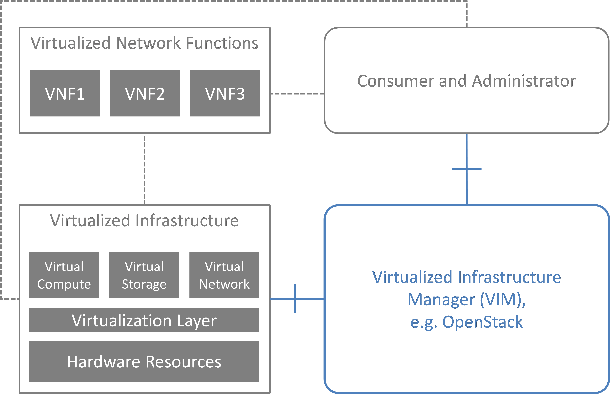
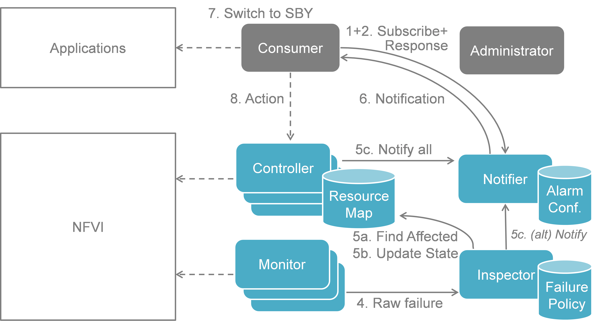
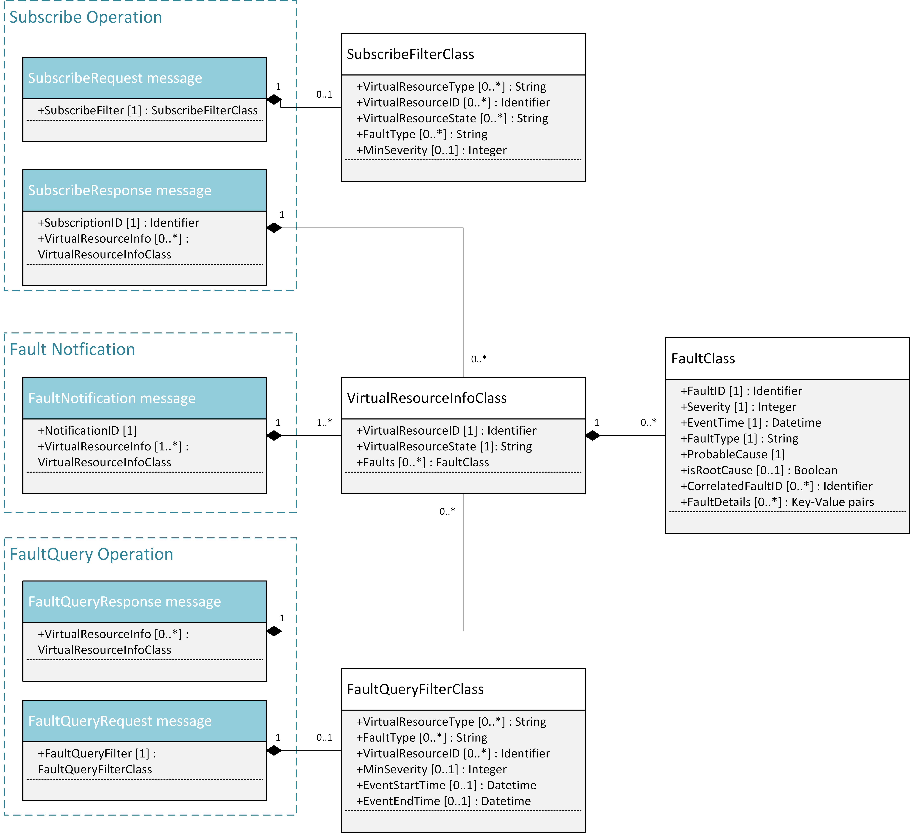
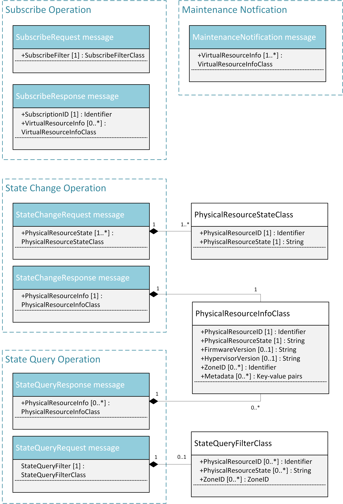

..
 This work is licensed under a Creative Commons Attribution 3.0 Unported
 License.

 http://creativecommons.org/licenses/by/3.0/legalcode

========================================
Doctor: Fault Management and Maintenance
========================================

:Project: Doctor, https://wiki.opnfv.org/doctor
:Editors: Ashiq Khan (NTT DOCOMO), Gerald Kunzmann (NTT DOCOMO)
:Authors: Ryota Mibu (NEC), Carlos Goncalves (NEC),
          Tomi Juvonen (Nokia), Tommy Lindgren (Ericsson)
:Project creation date: 2014-12-02
:Submission date: 2015-03-XX

:Abstract: Doctor is an OPNFV requirement project [1]. Its scope is
           NFVI fault management, and maintenance and it aims at
           developing and realizing the consequent implementation for
           the OPNFV reference platform.
           
           This deliverable is introducing the use cases and
           operational scenarios for Fault Management considered in
           the Doctor project. From the general features, a high level
           architecture describing logical building blocks and
           interfaces is derived. Finally, a detailed implementation
           plan is introduced, based on available open source
           components, and a related gap analysis is done as part of
           this project. The implementation plan finally discusses an
           initial realization for a NFVI fault management and
           maintenance solution in open source software.
           

.. contents::

Definition of terms
===================

Different SDOs and communities use different terminology related to
NFV / Cloud / SDN. This list tries to define an OPNFV terminology,
mapping/translating the OPNFV terms to terminology used in other
contexts.

NFV
    Network Function Virtualization

NFVI
    Network Function Virtualization Infrastructure; totality of all
    hardware and software components which build up the environment in
    which VNFs are deployed.

VNF
    Virtualized Network Function. Implementation of an Network
    Function that can be deployed on a Network Function Virtualization
    Infrastructure (NFVI).

VIM
    Virtualized Infrastructure Manager; functional block that is
    responsible for controlling and managing the NFVI compute, storage
    and network resources, usually within one operator's
    Infrastructure Domain, e.g. NFVI Point of Presence (NFVI-PoP).

NFVO
    Network Functions Virtualization Orchestrator; functional block
    that manages the Network Service (NS) lifecycle and coordinates
    the management of NS lifecycle, VNF lifecycle (supported by the
    VNFM) and NFVI resources (supported by the VIM) to ensure an
    optimized allocation of the necessary resources and connectivity.

VNFM
    Virtualized Network Function Manager; functional block that is
    responsible for the lifecycle management of VNF.

Consumer
    User-side Manager; consumer of the interfaces produced by the VIM;
    VNFM, NFVO, or Orchestrator in ETSI NFV terminology.

Administrator
    Administrator of the system, e.g. OAM in Telco context.

Virtual Machine (VM)
    Virtualized computation environment that behaves very much like a
    physical computer/server.

Virtual Storage
    Virtualized non-volatile storage allocated to a VM.

Virtual network
    Virtual network routes information among the network interfaces of
    VM instances and physical network interfaces, providing the
    necessary connectivity.

Physical resource
    Actual resources in NFVI; not visible to Consumer.

Virtual resource
    A Virtual Machine (VM), a virtual network, or virtualized storage;
    Offered resources to "Consumer" as result of infrastructure
    virtualization; visible to Consumer.

Introduction
============

The goal of this project is to build an NFVI fault management and
maintenance framework supporting high availability of the Network
Services on top of the virtualized infrastructure. The key feature is
immediate notification of unavailability of virtualized resources from
VIM, to support failure recovery, or failure avoidance of VNFs running
on them. Requirement survey and development of missing features in
NFVI and VIM are in scope of this project in order to fulfil
requirements for fault management and maintenance in NFV.

The purpose of this requirement project is to clarify the necessary
features of NFVI fault management, and maintenance, identify missing
features in the current OpenSource implementations, provide a
potential implementation architecture and plan, provide implementation
guidelines in relevant upstream projects to realize those missing
features, and define the VIM northbound interfaces necessary to
perform the task of NFVI fault management, and maintenance in
alignment with ETSI NFV [10].

Problem description
-------------------

A Virtualized Infrastructure Manager (VIM), e.g. OpenStack, cannot
detect certain Network Functions Virtualization Infrastructure (NFVI)
faults. This feature is necessary to detect the faults and notify the
Consumer in order to ensure the proper functioning of EPC VNFs like
MME and S/P-GW.

* EPC VNFs are often in active standby (ACT-SBY) configuration and
  need to switch to SBY mode as soon as relevant faults are detected
  in the active (ACT) VNF.

  * NFVI encompasses all elements building up the environment in which
    VNFs are deployed, e.g., Physical Machines, Hypervisors, Storage,
    and Network elements.

In addition, VIM, e.g. OpenStack, needs to receive maintenance
instructions from the Consumer, i.e. the operator/administrator of the
VNF.

* Change the state of certain Physical Machines (PMs), e.g. empty the
  PM, so that maintenance work can be performed at these machines.

Note: Although fault management and maintenance are different
operations in NFV, both are considered as part of this project as --
except for the trigger -- they share a very similar work and message
flow. Hence, from implementation perspective, these two are kept
together in the Doctor project because of this high degree of
similarity.

Use cases and scenarios
=======================

Telecom services often have very high requirements on service
performance. As a consequence they often utilize redundancy and high
availability (HA) mechanisms for both the service and the platform.
The HA support may be built-in or provided by the platform. In any
case, the HA support typically has a very fast detection and reaction
time to minimize service impact. The main changes proposed in this
document are about making a clear distinction between fault management
and recovery a) within the VIM/NFVI and b) High Availability support
for VNFs on the other, claiming that HA support within a VNF or as a
service from the platform is outside the scope of Doctor and is
discussed in the High Availability for OPNFV project. Doctor should
focus on detecting and remediating faults in the NFVI. This will
ensure that applications come back to a fully redundant configuration
faster than before. 

As an example, Telecom services can come with an Active-Standby
(ACT-SBY) configuration which is a (1+1) redundancy scheme. ACT and
SBY nodes (aka Physical Network Function (PNF) in ETSI NFV
terminology) are in a hot standby configuration. If an ACT node is
unable to function properly due to fault or any other reason, the SBY
node is instantly made ACT, and affected services can be provided
without any service interruption. 

The ACT-SBY configuration needs to be maintained. This means, when a
SBY node is made ACT, either the previously ACT node, after recovery,
shall be made SBY, or, a new SBY node needs to be configured. The
actual operations to instantiate/configure a new SBY are similar to
instantiating a new VNF and therefore are outside the scope of this
project.

The NFVI fault management and maintenance requirements aim at
providing fast failure detection of physical and virtualized resources
and remediation of the virtualized resources provided to Consumers
according to their predefined request to enable applications to
recover to a fully redundant mode of operation. 

1. Fault management using ACT-STB configuration (Triggered by critical
   error)
2. Recovery based on fault prediction (Preventing service stop by
   handling warnings)
3. VM Retirement (Managing service during NFVI maintenance, i.e. H/W,
   Hypervisor, Host OS, maintenance)

Faults
------

Fault management using ACT-STB configuration
^^^^^^^^^^^^^^^^^^^^^^^^^^^^^^^^^^^^^^^^^^^^

In Figure 1, a system-wide view of relevant functional blocks is
presented. OpenStack is considered as the VIM implementation (aka
Controller) which has interfaces with the NFVI and the Consumers. The
VNF implementation is represented as different virtual resources
marked by different colors. Consumers (VNFM or NFVO in ETSI NFV
terminology) own/manage the respective virtual resources (VMs in this
example) shown with the same colors.

The first requirement in this use case is that the Controller needs to
detect faults in the NVFI ("1. Fault Notification" in Figure 1)
affecting the proper functioning of the virtual resources (labelled as
VM-x) running on top of it. It should be possible to configure which
relevant fault items should be detected. The VIM (e.g. OpenStack)
itself could be extended to detect such faults. Alternatively, a third
party fault monitoring tool could be used which then informs the VIM
about such faults; this third party fault monitoring element can be
considered as a component of VIM from an architectural point of view.

Once such fault is detected, the VIM shall find out which virtual
resources are affected by this fault. In the example in Figure 1, VM-4
is affected by a fault in the Hardware Server-3. Such mapping shall be
maintained in the VIM, depicted as the "Server-VM info" table inside
the VIM. 

Once the VIM has identified which virtual resources are affected by
the fault, it needs to find out who is the Consumer (i.e. the
owner/manager) of the affected virtual resources (Step 2). In the
example shown in Figure 1, the VIM knows that for the red VM-4, the
manager is the red Consumer through an Ownership info table. The VIM
then notifies (Step 3 "Fault Notification") the red Consumer about
this fault, preferably with sufficient abstraction rather than
detailed physical fault information.

.. image:: images/figure1.png

The Consumer then switches to SBY configuration by switching the SBY
VNF to ACT state (Step 4). It further initiates a process to
instantiate/configure a new SBY. However, switching to SBY mode and
creating a new SBY machine is a VNFM/NFVO level operation and
therefore outside the scope of this project. Doctor project does not
create interfaces for such VNFM level configuration operations. Yet,
since the total failover time of a consumer service depends on both
the delay of such processes as well as the reaction time of Doctor
components, minimizing Doctor's reaction time is a necessary basic
ingredient to fast failover times in general.

Once the Consumer has switched to SBY configuration, it notifies (Step
5 "Instruction" in Figure 1) the VIM. The VIM can then take necessary
(e.g. pre-determined by the involved network operator) actions on how
to clean up the fault affected VMs (Step 6 "Execute Instruction").

The key issue in this use case is that a VIM (OpenStack in this
context) shall not take a standalone fault recovery action (e.g.
migration of the affected VMs) before the ACT-SBY switching is
complete, as that might violate the ACT-SBY configuration and render
the VNF out of service.

As an extension of the 1+1 ACT-SBY resilience pattern, a SBY instance
can act as backup to N ACT nodes (N+1). In this case, the basic
information flow remains the same, i.e., the consumer is informed of a
failure in order to activate the SBY node. However, in this case it
might be useful for the failure notification to cover a number of
failed instances due to the same fault (e.g., more than one instance
might be affected by a switch failure). The reaction of the consumer
might depend on whether only one active instance has failed (similar
to the ACT-SBY case), or if more active instances are needed as well.

Recovery based on fault predition
^^^^^^^^^^^^^^^^^^^^^^^^^^^^^^^^^

The fault management scenario explained in Clause 2.1.1 can also be
performed based on fault prediction. In such cases, in VIM, there is
an intelligent fault prediction module which, based on its NFVI
monitoring information, can predict an eminent fault in the elements
of NFVI. A simple example is raising temperature of a Hardware Server
which might trigger a pre-emptive recovery action. The requirements of
such fault prediction in the VIM are investigated in the OPNFV project
"Data Collection for Failure Prediction" [2].

This use case is very similar to "Fault management using ACT-STB
configuration" in Clause 2.1.1. Instead of a fault detection (Step 1
"Fault Notification in" Figure 1), the trigger comes from a fault
prediction module in the VIM, or from a third party module which
notifies the VIM about an eminent fault. From Step 2~5, the work flow
is the same as in the "Fault management using ACT-STB configuration"
use case, except in this case, the Consumer of a VM/VNF switches to
SBY configuration based on a predicted fault, rather than an occurred
fault.

NVFI Maintenance
----------------

VM Retirement
^^^^^^^^^^^^^

All network operators perform maintenance of their network
infrastructure, both regularly and irregularly. Besides the hardware,
virtualization is expected to increase the number of elements subject
to such maintenance as NFVI holds new elements like the hypervisor and
host OS. Maintenance of a particular resource element e.g. hardware,
hypervisor etc. may render a particular server hardware unusable until
the maintenance procedure is complete. 

However, the Consumer of VMs needs to know that such resources will be
unavailable because of NFVI maintenance. The following use case is
again to ensure that the ACT-SBY configuration is not violated. A
stand-alone action (e.g. live migration) from VIM/OpenStack to empty a
physical machine so that consequent maintenance procedure could be
performed may not only violate the ACT-SBY configuration, but also
have impact on real-time processing scenarios where dedicated
resources to virtual resources (e.g. VMs) are necessary and a pause in
operation (e.g. vCPU) is not allowed. The Consumer is in a position to
safely perform the switch between ACT and SBY nodes, or switch to an
alternative VNF forwarding graph so the hardware servers hosting the
ACT nodes can be emptied for the upcoming maintenance operation. Once
the target hardware servers are emptied (i.e. no virtual resources are
running on top), the VIM can mark them with an appropriate flag (i.e.
"maintenance" state) such that these servers are not considered for
hosting of virtual machines until these the maintenance flag is
cleared (i.e. nodes are back in "normal" status).

A high-level view of the maintenance procedure is presented in Figure
2. VIM/OpenStack, through its northbound interface, receives a
maintenance notification (Step 1 "Maintenance Instruction") from the
Administrator (e.g. a network operator) including information about
which hardware is subject to maintenance. Maintenance operations
include replacement/upgrade of hardware, update/upgrade of the
hypervisor/host OS, etc. 

The consequent steps to enable the Consumer to perform ACT-SBY
switching are very similar to the fault management scenario. From
VIM/OpenStack's internal database, it finds out which virtual
resources (VM-x) are running on those particular Hardware Servers and
who are the managers of those virtual resources (Step 2). The VIM then
informs the respective Consumer (VNFMs or NFVO) in Step 3 "Maintenance
Notification". Based on this, the Consumer takes necessary actions
(Step 4, e.g. switch to SBY configuration or switch VNF forwarding
graphs) and then notifies (Step 5 "Instruction") the VIM. Upon
receiving such notification, the VIM takes necessary actions (Step 6
"Execute Instruction" to empty the Hardware Servers so that consequent
maintenance operations could be performed. Due to the similarity for
Steps 2~6, the maintenance procedure and the fault management
procedure are investigated in the same project.

.. image:: images/figure2.png

High level architecture and general features
============================================

Functional overview
-------------------

The Doctor project circles around two distinct use cases: 1)
management of failures of virtualized resources and 2) planned
maintenance, e.g. migration, of virtualized resources. Both of them
may affect a VNF/application and the network service it provides, but
there is a difference in frequency and how they can be handled.

Failures are spontaneous events that may or may not have an impact on
the virtual resources. The Consumer should as soon as possible react
on the failure, e.g., by switching to the SBY node. The Consumer will
then instruct the VIM on how to clean up or repair the lost virtual
resources, i.e. restore the VM, VLAN or virtualized storage. How much
the applications are affected varies. Applications with built-in HA
support might experience a short decrease in retainability (e.g. an
ongoing session might be lost) while keeping availability
(establishment or re-establishment of sessions are not affected),
whereas the impact on applications without built-in HA may be more
serious. How much the network service is impacted depends on how the
service is implemented. With sufficient network redundancy the service
may be unaffected even when a specific resource fails. 

Planned maintenance impacting virtualized resources on the other hand
are events that are known in advance. This group includes e.g.
migration due to software upgrades of OS and hypervisor on a compute
host. Some of these might have been requested by the application or
its management solution, but there is also a need for coordination on
the actual operations on the virtual resources. There may be an impact
on the applications and the service, but since they are not
spontaneous events there is room for planning and coordination between
the application management organization and the infrastructure
management organization, including performing whatever actions that
would be required to minimize the problems.

Failure prediction is the process of pro-actively identifying
situations that may lead to a failure in the future unless acted on by
means of maintenance activities. From application point of view,
failure prediction may impact them in two ways: either the warning
time is so short that the application or its management solution does
not have time to react, in which case it is equal to the failure
scenario, or there is sufficient time to avoid the consequences by
means of maintenance activities, in which case it is similar to
planned maintenance.

Architecture Overview
---------------------

NFV and Cloud platform provide virtual resources and related control
functionality to users and administrators. Figure 3 shows the high
level architecture of NFV focusing on the NFVI, i.e. the virtualized
infrastructure. The NFVI provides virtual resources, such as virtual
machines (VM) and virtual networks. Those virtual resources are used
to run applications, i.e. VNFs, which could be component of a network
service which is managed by the consumer of the NFVI. The VIM provides
functionalities of controlling and viewing virtual resources on
hardware (physical) resources to the consumers, i.e. users and
administrators. OpenStack is a prominent candidate for this VIM. The
administrator may also directly control the NFVI without using the
VIM.

Although OpenStack is the target upstream project where the new
functional elements (Controller, Notifier, Monitor, and Inspector) are
expected to be implemented, a particular implementation method is not
assumed. Some of these elements may sit outside OpenStack and offer a
northbound interface to OpenStack.

General Features and Requirements
---------------------------------

The following features are required for the VIM to achieve high
availability of applications (e.g. MME, S/P-GW) and the Network
Services:

* Monitoring: Monitor physical and virtual resources.
* Detection: Detect unavailability of physical resources.
* Correlation and Cognition: Correlate faults and identify affected
  virtual resources.
* Notification: Notify unavailable virtual resources to their
  Consumer(s).
* Recovery action: Execute actions to process fault recovery and
  maintenance.

The time interval between fault monitoring and triggering of a
corresponding action shall be less than 1 second.

Monitoring
^^^^^^^^^^

The VIM shall monitor physical and virtual resources for
unavailability and suspicious behavior.

Detection
^^^^^^^^^

The VIM shall detect unavailability and failures of physical resources
that might cause errors/faults in virtual resources running on top of
them. Unavailability of physical resource is detected by various
monitoring and managing tools for hardware and software components.
This may include also predicting upcoming faults. Note, fault
prediction is out of scope of this project and is investigated in the
OPNFV "Data Collection for Failure Prediction" project [2].

The fault items/events to be detected shall be configurable.

The configuration shall enable Failure Selection and Aggregation.
Failure aggregation means VIM can find out unavailability of physical
resource from more than two non-critical failures related to the same
resource.

There are two types of unavailability - immediate and future:

* Immediate unavailability can be detected by setting traps of raw
  failures on hardware monitoring tools.
* Future unavailability can be found by receiving maintenance
  instructions issued by the administrator of the NFVI or by failure
  prediction mechanisms.

Correlation and Cognition
^^^^^^^^^^^^^^^^^^^^^^^^^

The VIM shall correlate each fault to the impacted virtual resource,
i.e. the VIM shall identify unavailability of virtualized resources
that are or will be affected by failures on the physical resources
under them. Unavailability of virtualized resource is found by
referring to the mapping of physical and virtualized resources. 

The relation from physical resources to virtualized resources shall be
configurable, as the cause of unavailability of virtualized resources
can be different in technologies and policies of deployment.

Failure aggregation is also required in this feature, e.g., a user may
request more than two failures on standby VMs in an (N+M) deployment
model.

Notification
^^^^^^^^^^^^

The VIM shall notify the alarm, i.e. unavailability of virtual
resource(s), to the Consumer owning it over the northbound interface,
such that the Consumers impacted by the failure can take appropriate
actions to recover from the failure.

The VIM shall also notify the unavailability of physical resources to
its Administrator.

All notifications shall be transferred immediately in order to
minimize the stalling time of the network service and to avoid over
assignment caused by delay of capability updates.

There may be multiple consumers, so the VIM has to find out the owner
of a faulty resource. Moreover, there may be a large number of virtual
and physical resources in a real deployment, so polling the state of
all resources to the VIM would lead to heavy signaling traffic. Thus,
a publication/subscription messaging model is better suited for these
notifications, as notifications are only sent to subscribed consumers.

Note: the VIM should only accept individual notification URLs for each
resource by its owner or administrator.

Notifications reporting to the Consumer about the unavailability of
virtualized resources are including a description of the fault
preferably with sufficient abstraction rather than detailed physical
fault information. Flexibility in the notifications is important, for
example the receiver function in the consumer-side implementation
could have different schema, location, and policies (e.g. receive or
not, aggregate events with the same cause, etc.).

Recovery Action
^^^^^^^^^^^^^^^

The VIM shall recover the failed virtual resources according to the
pre-defined behavior for that resource. In principle this means that
the owner of the resource (i.e., its consumer or administrator) can
define which recovery actions shall be taken by the VIM. Examples are
a restart of the VM, migration/evacuation of the VM, or no action. 

In the "Fault management using ACT-STB configuration" use case, no
automatic actions will be taken by the VIM, but all recovery actions
executed by the VIM and the NFVI will be instructed and coordinated by
the Consumer.

High level northbound interface specification
---------------------------------------------

Fault management
^^^^^^^^^^^^^^^^

This interface allows the Consumer to subscribe to fault notification
from the VIM. Using a filter, the Consumer can narrow down which
faults should be notified. A fault notification will trigger the
Consumer to switch from ACT to SBY configuration and initiate fault
recovery actions. A fault query request/response message exchange
allows the Consumer to find out about active alarms at the VIM. A
filter can be used to narrow down the alarms returned in the response
message.

.. image:: images/figure4.png

The high level message flow for the fault management use case is shown
in Figure 4. It consists of the following steps:

1. The NFVI sends monitoring events for resources the VIM has been
   subscribed to. 
2. Event correlation, fault detection and aggregation in VIM.
3. Database lookup to find the virtual resources affected by the
   detected fault.
4. Fault notification to Consumer.
5. The Consumer switches to standby configuration (SBY)
6. Instructions to VIM requesting certain actions to be performed on
   the affected resources, for example migrate/update/terminate
   specific resource(s). After reception of such instructions, the VIM
   is executing the requested action, e.g. it will migrate or
   terminate a virtual resource.

NFVI Maintenance
^^^^^^^^^^^^^^^^

The NFVI maintenance interface allows the Administrator to notify the
VIM about a planned maintenance operation on the NFVI. A maintenance
operation may for example be an update of the server firmware or the
hypervisor. The MaintenanceRequest message contains instructions to
change the state of the resource from 'normal' to 'maintenance'. After
receiving the MaintenanceRequest, the VIM will notify the Consumer
about the planned maintenance operation, whereupon the Consumer will
switch to standby (SBY) configuration to allow the maintenance action
to be executed. After the request was executed successfully (i.e., the
physical resources have been emptied) or the operation resulted in an
error state, the VIM sends a MaintenanceResponse message back to the
Administrator.

.. image:: images/figure5.png

The high level message flow for the NFVI maintenance use case is shown
in Figure 5. It consists of the following steps:

1. Maintenance trigger received from administrator.
2. VIM switches the affected NFVI resources to "maintenance" state,
   i.e., the NFVI resources are prepared for the maintenance
   operation. For example, the virtual resources should not be used
   for further allocation/migration requests and the VIM will
   coordinate with the Consumer on how to best empty the physical
   resources.
3. Database lookup to find the virtual resources affected by the
   detected maintenance operation.
4. StateChange notification to inform Consumer about planned
   maintenance operation.
5. The Consumer switches to standby configuration (SBY)
6. Instructions from Consumer to VIM requesting certain actions to be
   performed (step 6a). After receiving such instructions, the VIM
   executes the requested action in order to empty the physical
   resources (step 6b).
7. Maintenance response from VIM to inform the Administrator that the
   physical machines have been emptied (or the operation resulted in
   an error state).
8. The Administrator is coordinating and executing the maintenance
   operation/work on the NFVI.

Faults
------

Faults in the listed elements need to be immediately notified to the
VNFM in order to perform an immediate action like live migration or
switch to a hot standby entity. In addition, a maintenance action
should be triggered to, e.g., reboot the server or replace a defect
hardware element.

Faults can be of different severity, i.e. critical, warning,
maintenance, or info. Critical faults require immediate action as a
severe degradation of the system has happened or is expected. Warnings
indicate that the system performance is going down: related actions
include closer (e.g. more frequent) monitoring of that part of the
system or preparation for a cold migration to a backup VM. Type
maintenance may trigger maintenance actions like a re-boot of the
server or replacement of a faulty, but redundant HW. Info messages do
not require any action.

Faults can be gathered by, e.g., enabling SNMP and installing some
open source tools to catch and poll SNMP. When using for example
Zabbix one can also put an agent running on the hosts to catch any
other fault. Table 1 provides a list of high level faults that are
considered within the scope of the Doctor project requiring immediate
action by the VNFM.

# TODO(cgoncalves): Table 1. High level list of faults

Gap analysis in upstream projects
=================================

This section presents the findings of gaps on existing VIM platforms.
The focus was to identify gaps based on the features and requirements
specified in Section 3.3. The analysis work performed resulted in the
identification of gaps of which are herein presented.

VIM Northbound Interface
------------------------

Immediate Notification
^^^^^^^^^^^^^^^^^^^^^^

* Type: 'deficienty in performance'
* Description

  + To-be

    - VIM has to notify unavailability of virtual resource (fault) to
      VIM user immediately.
    - Notification should be passed in '1 second' after fault
      detected/notified by VIM.
    - Also, the following conditions/requirement have to be met:
      
      - Only the user can receive notification of fault related to
        owned virtual resource(s).

  + As-is

    - OpenStack Metering 'Ceilometer' can notify unavailability of
      virtual resource (fault) to the owner of virtual resource based
      on alarm configuration by the user.

      - Ceilometer Alarm API:
        http://docs.openstack.org/developer/ceilometer/webapi/v2.html#alarms

    - Alarm notifications are triggered by alarm evaluator instead
      notification agents that might receive faults

      - Ceilometer Architecture:
        http://docs.openstack.org/developer/ceilometer/architecture.html#id1

    - Evaluation interval should be equal to or larger than configured
      pipeline interval for collection of underlying metrics.

      - https://github.com/openstack/ceilometer/blob/stable/juno/ceilometer/alarm/service.py#L38-42

    - The interval for collection has to be set large enough which
      depends on the size of the deployment and the number of metrics
      to be collected.
    - The interval may not be less than one second in even small
      deployments. The default value is 60 seconds.
    - Alternative: OpenStack has a message bus to publish system
      events. Operator can allow user to connect this, but there are
      no functions to filter out other events that should not be
      passed to the user or does not requested by the user.

  + Gap

    - Fault notifications cannot be received immediately by Ceilometer.

Maintenance Notification
^^^^^^^^^^^^^^^^^^^^^^^^

* Type: 'missing'
* Description

  + To-be

    - VIM has to notify unavailability of virtual resource triggered
      by NFVI maintenance to VIM user.
    - Also, the following conditions/requirements have to be met:

      - VIM should accept maintenance message from administrator and
        mark target physical resource "in maintenance".
      - Only the owner of virtual resource hosted by target physical
        resource can receive the notification that can trigger some
        process for applications which are running on the virtual
        resource (e.g. cut off VM).

    - As-is

      - OpenStack: None
      - AWS (just for study)
        
        - AWS provides API and CLI to view status of resource (VM) and
          to create instance status and system status alarms to notify
          you when an instance has a failed status check.
          http://docs.aws.amazon.com/AWSEC2/latest/UserGuide/monitoring-instances-status-check_sched.html
        - AWS provides API and CLI to view scheduled events, such as a
          reboot or retirement, for your instances. Also, those events
          will be notified via e-mail.
          http://docs.aws.amazon.com/AWSEC2/latest/UserGuide/monitoring-system-instance-status-check.html

    - Gap

      - VIM user cannot receive maintenance notifications.

VIM Southbound interface
------------------------

Normalization of data collection models
^^^^^^^^^^^^^^^^^^^^^^^^^^^^^^^^^^^^^^^

* Type: 'missing'
* Description

  + To-be

    - A normalized data format needs to be created to cope with the
      many data models from different monitoring solutions.

  + As-is

    - Data can be collected from many places (e.g. Zabbix, Nagios,
      Cacti, Zenoss). Although each solution establishes its own data
      models, no common data abstraction models exist in OpenStack.

  + Gap

    - Normalized data format does not exist.

OpenStack
---------

Ceilometer
^^^^^^^^^^

OpenStack offers a telemetry service, Ceilometer, for collecting
measurements of the utilization of physical and virtual resources [4].
Ceilometer can collect a number of metrics across multiple OpenStack
components and watch for variations and trigger alarms based upon on
the collected data.

Scalability of fault aggregation
________________________________

* Type: 'scalability issue'
* Description

  + To-be

    - Be able to scale to a large deployment, where thousands of
      monitoring events per second need to be analyzed.

  + As-is

    - Performance issue when scaling to medium-sized deployments.

  + Gap

    - Ceilometer seems not suitable for monitoring medium and large
       scale NFVI deployments.

* Related blueprints

  + Usage of Zabbix for fault aggregation [10]. Zabbix can support a
    much higher number of fault events (up to 15.000 events per
    second, but obviously also has some upper bound:
    http://blog.zabbix.com/scalable-zabbix-lessons-on-hitting-9400-nvps/2615/ 

  + Decentralized/hierarchical deployment with multiple instances,
    where one instance is only responsible for a small NFVI.

Monitoring of hardware and software
___________________________________

* Type: 'missing (lack of functionality)'
* Description

  + To-be

    - OpenStack (as VIM) should monitor various hardware and software
      in NFVI to handle faults on them by Ceilometer.
    - OpenStack may have monitoring functionality in itself and can be
      integrated with third party monitoring tools.
    - OpenStack need to be able to detect the faults listed in Section
      3.5.

  - As-is

    - For each deployment of OpenStack, an operator has responsibility
      to configure monitoring tools with relevant scripts or plugins
      in order to monitor hardware and software.
    - OpenStack Ceilometer does not monitor hardware and software to
      capture faults.

    +	Gap

      - Ceilometer is not able to detect and handle all faults listed
        in Section 3.5.

* Related blueprints / workarounds

  - Use other dedicated monitoring tools like Zabbix or Monasca

Nova
^^^^

OpenStack Nova [5] is a mature and widely known and used component in
OpenStack cloud deployments. It is the main part of an infrastructure
as a service system providing a cloud computing fabric controller,
supporting a wide diversity of virtualization and container
technologies.

Nova has proven throughout these past years to be highly available and
fault-tolerant. Featuring its own API, it also provides a
compatibility API with Amazon EC2 APIs.

Fencing instances of an unreachable host
________________________________________

* Type: 'missing'
* Description

  + To-be

    - Safe VM evacuation has to be preceded by fencing (isolate, shut
      down) the failed host. Failing to do so -- when the perceived
      disconnection is due to some transient or partial failure -- the
      evacuation might lead into two identical instances running
      together and having a dangerous conflict.
    - Fencing Instances of an unreachable host:
      https://wiki.openstack.org/wiki/Fencing_Instances_of_an_Unreachable_Host

  + As-is

    - When a VM goes down due to a host HW, host OS or hypervisor
      failure, nothing happens in OpenStack. The VMs of a crashed
      host/hypervisor are reported to be live and OK through the
      OpenStack API.

  + Gap

    - OpenStack does not fence instances of an unreachable host.

* Related blueprints

  + https://blueprints.launchpad.net/nova/+spec/fencing

Evacuate VMs on Maintenance mode
________________________________

* Type: 'missing'
* Description

  + To-be

    - When maintenance mode for a compute host is set, trigger VM
      evacuation to available compute nodes before bringing the host
      down for maintenance.

  + As-is

    - If setting a compute node to a maintenance mode, OpenStack only
      schedules evacuation of all VMs to available compute nodes if
      in-maintenance compute node runs the XenAPI and VMware ESX
      hypervisors. Other hypervisors (e.g. KVM) are not supported and,
      hence, guest VMs will likely stop running due to maintenance
      actions administrator may perform (e.g. hardware upgrades, OS
      updates).

  + Gap

    - Nova libvirt hypervisor driver does not implement automatic
      guest VMs evacuation when compute nodes are set to maintenance
      mode.
      ($ nova host-update --maintenance enable <hostname>)

Monasca
^^^^^^^

Monasca is an open-source monitoring-as-a-service (MONaaS) solution
that integrates with OpenStack. Even though it is still in its early
days, it is the interest of the community that the platform be
multi-tenant, highly scalable, performant and fault-tolerant.
Companion with a streaming alarm engine and a notification engine, is
a northbound REST API users can use to interact with Monasca. Hundreds
of thousands of metrics per second can be processed [8].

Anomaly detection
_________________

* Type: 'missing (lack of functionality)'
* Description

  + To-be

    - Detect the failure and perform a root cause analysis to filter
      out other alarms that may be triggered due to their cascading
      relation.

  + As-is

    - A mechanism to detect root causes of failures is not available.

  + Gap

    - Certain failures can trigger many alarms due to their dependency
      on the underlying root cause of failure. Knowing the root cause
      can help filter out unnecessary and overwhelming alarms.

* Related blueprints / workarounds

  + Monasca as of now lacks this feature, although the community is
    aware and working toward supporting it.

Sensor monitoring
_________________

* Type: 'missing (lack of functionality)'
* Description

  + To-be

    - It should support monitoring sensor data retrieving, for
      instance, from IPMI.

  + As-is

    - Monasca does not monitor sensor data

  + Gap

    - Sensor monitoring is of the most importance. It provides
      operators status on the state of the physical infrastructure
      (e.g. temperature, fans).

* Related blueprints / workarounds

  + Monasca can be configured to use third-party monitoring solutions
    (e.g. Nagios, Cacti) for retrieving additional data.

Hardware monitoring tools
-------------------------

Zabbix
^^^^^^

Zabbix is an open-source solution for monitoring availability and
performance of infrastructure components (i.e. servers and network
devices), as well as applications [10]. It can be customized for use
with OpenStack. It is a mature tool and has been proven to be able to
scale to large systems with 100,000s of devices.

Delay in execution of actions
_____________________________

* Type: 'deficiency in performance'
* Description

  + To-be

    - After detecting a fault, the monitoring tool should immediately
      execute the appropriate action, e.g. inform the manager through
      the NB I/F

  + As-is

    - A delay of around 10 seconds was measured in two independent
      testbed deployments

  + Gap

    - Cause of the delay needs to be identified and fixed

Detailed implementation plan
============================

This section is describing a detailed implementation plan, which is
based on the high level architecture introduced in Section 3. Section
5.1 describes the functional blocks of the Doctor architecture, which
is followed by a high level message flow in Section 5.2. Section 5.3
provides a mapping of selected existing open source components to the
building blocks of the Doctor architecture. Thereby, the selection of
components is based on their maturity and the gap analysis executed in
Section 4. Sections 5.4 and 5.5 detail the specification of the
related northbound interface and the related information elements.
Finally, Section 5.6 provides a first set of blueprints to address
selected gaps required for the realization functionalities of the
Doctor project.

Functional Blocks
-----------------

This section is introducing the functional blocks to form the VIM.
OpenStack was selected as the candidate for implementation. Inside the
VIM, 4 different building blocks are defined (see Figure 6).

.. image:: images/figure6.png

Monitor
^^^^^^^

The Monitor module has the responsibility for monitoring the
virtualized infrastructure. There are already many existing tools and
services (e.g. Zabbix) to monitor different aspects of hardware and
software resources which can be used for this purpose.

Inspector
^^^^^^^^^

The Inspector module has the ability a) to receive various failure
notifications regarding physical resource(s) from Monitor module(s),
b) to find the affected virtual resource(s) by querying the resource
map in the Controller, and c) to update the state of the virtual
resource (and physical resource).

The Inspector has drivers for different types of events and resources
to integrate any type of Monitor and Controller modules. It also uses
a failure policy database to decide on the failure selection and
aggregation from raw events. This failure policy database is
configured by the Administrator.

The reason for separation of the Inspector and Controller modules is
to make the Controller focus on simple operations by avoiding a tight
integration of various health check mechanisms into the Controller.

Controller
^^^^^^^^^^

The Controller is responsible for maintaining the resource map (i.e.
the mapping from physical resources to virtual resources), accepting
update requests for the resource state(s) (exposing as provider API),
and sending all failure events regarding virtual resources to the
Notifier. Optionally, the Controller has the ability to poison the
state of virtual resources mapping to physical resources for which it
has received failure notifications from the Inspector. The Controller
also re-calculates the capacity of the NVFI when receiving a failure
notification for a physical resource.

In a real-world deployment, the VIM may have several controllers, one
for each resource type, such as Nova, Neutron and Cinder in OpenStack.
Each controller maintains a database of virtual and physical resources
which shall be the master source for resource information inside the
VIM.

Notifier
^^^^^^^^

The focus of the Notifier is on selecting and aggregating failure
events received from the controller based on policies mandated by the
Consumer. Therefore, it allows the Consumer to subscribe for alarms
regarding virtual resources using a method such as API endpoint. After
having received a fault event from a Controller, it will notify the
fault to the Consumer by referring to the alarm configuration which
was defined by the Consumer earlier on.

To reduce complexity of Controller, it is a good approach that the
Controllers emit all notifications without any filtering mechanism and
another service (i.e. Notifier) handles those notifications properly.
This is the general philosophy of notifications in OpenStack. Note a
fault message consumed by the Notifier is different from the fault
message received by the Inspector; the former message is related to
virtual resources which are visible to users with relevant ownership,
whereas the latter is related to raw devices or small entities which
should be handled with an administrator privilege.

The northbound interface between the Notifier and the
Consumer/Administrator is specified in Section 5.5.

Sequence
--------

Fault Management
^^^^^^^^^^^^^^^^

The detailed work flow for fault management is as follows (see also
Figure 7):

1. Request to subscribe to monitor specific virtual resources. A query
   filter can be used to narrow down the alarms the Consumer wants to
   be informed about.
2. Each subscription request is acknowledged with a subscribe response
   message. The response message contains information about the
   subscribed virtual resources, in particular if a subscribed virtual
   resource is in "alarm" state.
3. The NFVI sends monitoring events for resources the VIM has been
   subscribed to. Note: this subscription message exchange between the
   VIM and NFVI is not shown in this message flow.
4. Event correlation, fault detection and aggregation in VIM.
5. Database lookup to find the virtual resources affected by the
   detected fault.
6. Fault notification to Consumer.
7. The Consumer switches to standby configuration (SBY)
8. Instructions to VIM requesting certain actions to be performed on
   the affected resources, for example migrate/update/terminate
   specific resource(s). After reception of such instructions, the VIM
   is executing the requested action, e.g. it will migrate or
   terminate a virtual resource.
   
   a. Query request from Consumer to VIM to get information about the
   current status of a resource.
   b. Response to the query request with information about the current
   status of the queried resource. In case the resource is in "fault"
   state, information about the related fault(s) is returned.

In order to allow for quick reaction on failures, the time interval
between fault detection in step 3 and the corresponding recovery
actions in step 7 and 8 shall be less than 1 second.

.. image:: images/figure7.png

Figure 8 shows a more detailed message flow (Steps 4 to 6) between the
4 building blocks introduced in Section 5.1.

4. The Monitor observed a fault in the NFVI and reports the raw fault
   to the Inspector.

   a) The Inspector filters and aggregates the faults using
      pre-configured failure policies.

5.
   a) The Inspector queries the Resource Map to find the virtual
      resources affected by the raw fault in the NFVI.
   b) The Inspector updates the state of the affected virtual
      resources in the Resource Map.
   c) The Controller observes a change of the virtual resource state
      and informs the Notifier about the state change and the related
      alarm(s).

6. The Notifier is performing another filtering and aggregation of the
   changes and alarms based on the pre-configured alarm configuration.
   Finally, a fault notification is sent to northbound to the
   Consumer.

NFVI Maintenance
^^^^^^^^^^^^^^^^

The detailed work flow for NFVI maintenance is shown in Figure 9 and
has the following steps. Note that steps 1, 2, and 5 to 8a in the NFVI
maintenance work flow are very similar to the steps in the fault
management work flow and share a similar implementation plan in
Release 1.

1. Subscribe to fault/maintenance notifications.
2. Response to subscribe request.
3. Maintenance trigger received from administrator.
4. VIM switches NFVI resources to "maintenance" state.  This, e.g.,
   means they should not be used for further allocation/migration
   requests
5. Database lookup to find the virtual resources affected by the
   detected maintenance operation.
6. Maintenance notification to Consumer.
7. The Consumer switches to standby configuration (SBY)
8. Instructions from Consumer to VIM requesting certain recovery
   actions to be performed (step 7a). After reception of such
   instructions, the VIM is executing the requested action in order to
   empty the physical resources (step 7b).
9. Maintenance response from VIM to inform the Administrator that the
   physical machines have been emptied (or the operation resulted in
   an error state).
10. Administrator is coordinating and executing the maintenance
    operation/work on the NFVI.

    a) Query request from Administrator to VIM to get information
    about the current state of a resource.

    b) Response to the query request with information about the
    current state of the queried resource(s). In case the resource is
    in "maintenance" state, information about the related maintenance
    operation is returned.

.. image:: images/figure9.png

.. image:: images/figure10.png

Figure 10 shows a more detailed message flow (Steps 4 to 6) between
the 4 building blocks introduced in Section 5.1.. 

3. The Administrator is sending a StateChange request to the
   Controller residing in the VIM.
4. The Controller queries the Resource Map to find the virtual
   resources affected by the planned maintenance operation.
5. 

  a) The Controller updates the state of the affected virtual
  resources in the Resource Map database.

  c) The Controller informs the Notifier about the virtual resources
  that will be affected by the maintenance operation.

6. A maintenance notification is sent to northbound to the Consumer.

9. The Controller informs the Administrator after the physical
   resources have been freed.

Implementation plan for OPNFV Release 1
---------------------------------------

Fault management
^^^^^^^^^^^^^^^^

Figure 11 shows the implementation plan based on OpenStack and related
components as planned for Release 1. Hereby, the Monitor can be
realized by Zabbix. The Controller is realized by OpenStack Nova [5],
Neutron [6], and Cinder [7] for compute, network, and storage,
respectively. The Inspector can be realized by Monasca [8] or a simple
script querying Nova in order to map between physical and virtual
resources. The Notifier will be realized by Ceilometer [4] receiving
failure events in its notification bus. 

Figure 12 shows the inner-workings of Ceilometer. After receiving an
"event" on its notification bus, first a notification agent will grab
the event and send a "notification" to the Collector. The collector is
writing the notifications received to the Ceilometer databases.

In the existing Ceilometer implementation, an alarm evaluator is
periodically polling those databases through the APIs provided. If it
finds new alarms, it will evaluate them based on the pre-defined alarm
configuration, and depending on the configuration, it will hand a
message to the Alarm Notifier, which in turn will send the alarm
message northbound to the Consumer. Figure 12 also shows an optimized
work flow for Ceilometer with the goal to reduce the delay for fault
notifications to the Consumer. The approach is to implement a new
notification agent (called "publisher" in Ceilometer terminology)
which is directly sending the alarm through the "Notification Bus" to
a new "Notification-driven Alarm Evaluator (NAE)" (see Sections 5.6.2
and 5.6.3), thereby bypassing the Collector and avoiding the
additional delay of the existing polling-based alarm evaluator. The
NAE is similar to the OpenStack "Alarm Evaluator", but is triggered by
incoming notifications instead of periodically polling the OpenStack
"Alarms" database for new alarms. The Ceilometer "Alarms" database can
hold three states: "normal", "insufficient data", and "fired". It is
representing a persistent alarm database. In order to realize the
Doctor requirements, we need to define new "meters" in the database
(see Section 5.6.1).

.. image:: images/figure11.png

.. image:: images/figure12.png

NFVI Maintenance
^^^^^^^^^^^^^^^^

For NFVI Maintenance, a quite similar implementation plan exists.
Instead of a raw fault being observed by the Monitor, the
Administrator is sending a Maintenance Request through the northbound
interface towards the Controller residing in the VIM. Similar to the
Fault Management use case, the Controller (in our case OpenStack Nova)
will send a maintenance event to the Notifier (i.e. Ceilometer in our
implementation). Within Ceilometer, the same workflow as described in
the previous section applies. In addition, the Controller(s) will take
appropriate actions to evacuate the physical machines in order to
prepare them for the planned maintenance operation. After the physical
machines are emptied, the Controller will inform the Administrator
that it can initiate the maintenance.

Information elements
--------------------

This section introduces all attributes and information elements used
in the messages exchange on the northbound interfaces between the VIM
and the VNFO and VNFM.

Note: The information elements will be aligned with current work in
ETSI NFV IFA working group.

Simple information elements:

* SubscriptionID: identifies a subscription to receive fault or
  maintenance notifications.
* NotificationID: identifies a fault or maintenance notification.
* VirtualResourceID (Identifier): identifies a virtual resource
  affected by a fault or a maintenance action of the underlying
  physical resource.
* PhysicalResourceID (Identifier): identifies a physical resource
  affected by a fault or maintenance action.
* VirtualResourceState (String): state of a virtual resource, e.g.
  "normal", "maintenance", "down", "error".
* PhysicalResourceState (String): state of a physical resource, e.g.
  "normal", "maintenance", "down", "error".
* VirtualResourceType (String): type of the virtual resource, e.g.
  "virtual machine", "virtual memory", "virtual storage", "virtual
  CPU", or "virtual NIC".
* FaultID (Identifier): identifies the related fault in the underlying
  physical resource. This can be used to correlate different fault
  notifications caused by the same fault in the physical resource.
* FaultType (String): Type of the fault. The allowed values for this
  parameter depend on the type of the related physical resource. For
  example, a resource of type "compute hardware" may have faults of
  type "CPU failure", "memory failure", "network card failure", etc.
* Severity (Integer): value expressing the severity of the fault. The
  higher the value, the more severe the fault.
* MinSeverity (Integer): value used in filter information elements.
  Only faults with a severity higher than the MinSeverity value will
  be notified to the Consumer.
* EventTime (Datetime): Time when the fault was observed.
* EventStartTime and EventEndTime (Datetime): Datetime range that can
  be used in a FaultQueryFilter to narrow down the faults to be
  queried.
* ProbableCause: information about the probable cause of the fault.
* CorrelatedFaultID (Integer): list of other faults correlated to this
  fault.
* isRootCause (Boolean): Parameter indicating if this fault is the
  root for other correlated faults. If TRUE, then the faults listed in
  the parameter CorrelatedFaultID are caused by this fault.
* FaultDetails (Key-value pair): provides additional information about
  the fault, e.g. information about the threshold, monitored
  attributes, indication of the trend of the monitored parameter.
* FirmwareVersion (String): current version of the firmware of a
  physical resource.
* HypervisorVersion (String): current version of a hypervisor.
* ZoneID (Identifier): Identifier of the resource zone. A resource
  zone it the logical separation of physical and software resources in
  an NFVI deployment for physical isolation, redundancy, or
  administrative designation.
* Metadata (Key-Value-Pairs): provides additional information of a
  physical resource in maintenance/error state.

Complex information elements (see also UML diagrams in Figure 13 and
Figure 14):

* VirtualResourceInfoClass:

  + VirtualResourceID [1] (Identifier)
  + VirtualResourceState [1] (String)
  + Faults [0..*] (FaultClass): For each resource, all faults
    including detailed information about the faults are provided.

* FaultClass: The parameters of the FaultClass are partially based on
  ETSI TS 132 111-2 (V12.1.0), which is specifying fault
  management in 3GPP, in particular describing the information
  elements used for alarm notifications.

  - FaultID [1] (Identifier)
  - FaultType [1]
  - Severity [1] (Integer)
  - EventTime [1] (Datetime)
  - ProbableCause [1]
  - CorrelatedFaultID [0..*] (Identifier)
  - FaultDetails [0..*] (Key-value pair)

* SubscribeFilterClass 

  - VirtualResourceType [0..*] (String) 
  - VirtualResourceID [0..*] (Identifier)
  - FaultType [0..*] (String)
  - MinSeverity [0..1] (Integer)

* FaultQueryFilterClass: narrows down the FaultQueryRequest, for
  example it limits the query to certain physical resources, a certain
  zone, a given fault type/severity/cause, or a specific FaultID.

  - VirtualResourceType [0..*] (String) 
  - VirtualResourceID [0..*] (Identifier)
  - FaultType [0..*] (String)
  - MinSeverity [0..1] (Integer)
  - EventStartTime [0..1] (Datetime)
  - EventEndTime [0..1] (Datetime)

* PhysicalResourceStateClass:

  - PhysicalResourceID [1] (Identifier)
  - PhysicalResourceState [1] (String): mandates the new state of the
    physical resource.

* PhysicalResourceInfoClass:

  - PhysicalResourceID [1] (Identifier)
  - PhysicalResourceState [1] (String)
  - FirmwareVersion [0..1] (String)
  - HypervisorVersion [0..1] (String)
  - ZoneID [0..1] (Identifier)

* StateQueryFilterClass: narrows down a StateQueryRequest, for example
  it limits the query to certain physical resources, a certain zone,
  or a given resource state (e.g., only resources in "maintenance"
  state).

  - PhysicalResourceID [1] (Identifier)
  - PhysicalResourceState [1] (String)
  - ZoneID [0..1] (Identifier)

Detailed northbound interface specification
-------------------------------------------

This section is specifying the northbound interfaces for fault
management and NFVI maintenance between the VIM on the one end and the
Consumer and the Administrator on the other ends. For each interface
all messages and related information elements are provided.

Note: The interface definition will be aligned with current work in
ETSI NFV IFA working group .

All of the interfaces described below are produced by the VIM and
consumed by the Consumer or Administrator.

Fault management interface
^^^^^^^^^^^^^^^^^^^^^^^^^^

This interface allows the VIM to notify the Consumer about a virtual
resource that is affected by a fault, either within the virtual
resource itself or by the underlying virtualization infrastructure.
The messages on this interface are shown in Figure 13 and explained in
detail in the following subsections.

Note: The information elements used in this section are described in
detail in Section 5.4.

SubscribeRequest (Consumer -> VIM)
__________________________________

Subscription from Consumer to VIM to be notified about faults of
specific resources. The faults to be notified about can be narrowed
down using a subscribe filter.

Parameters:

- SubscribeFilter [1] (SubscribeFilterClass): Optional information to
  narrow down the faults that shall be notified to the Consumer, for
  example limit to specific VirtualResourceID(s), severity, or cause
  of the alarm.

SubscribeResponse (VIM -> Consumer)
___________________________________

Response to a subscribe request message including information about
the subscribed resources, in particular if they are in "fault/error"
state.

Parameters:

* SubscriptionID [1] (Identifier): Unique identifier for the
  subscription. It can be used to delete or update the subscription.
* VirtualResourceInfo [0..*] (VirtualResourceInfoClass): Provides
  additional information about the subscribed resources, i.e., a list
  of the related resources, the current state of the resources, etc.

FaultNotification (VIM -> Consumer)
___________________________________

Notification about a virtual resource that is affected by a fault,
either within the virtual resource itself or by the underlying
virtualization infrastructure. After reception of this request, the
Consumer will decide about the optimal action to resolve the fault.
This includes actions like switching to a hot standby virtual
resource, migration of the fault virtual resource to another physical
machine, termination of the faulty virtual resource and instantiation
of a new virtual resource in order to provide a new hot standby
resource. Existing resource management interfaces and messages between
the Consumer and the VIM can be used for those actions, and there is
no need to define additional actions on the Fault Management
Interface.

Parameters:

* NotificationID [1] (Identifier): Unique identifier for the
  notification.
* VirtualResourceInfo [1..*] (VirtualResourceInfoClass): List of
  faulty resources with detailed information about the faults. 

FaultQueryRequest (Consumer -> VIM)
___________________________________

Request to find out about active alarms at the VIM. A FaultQueryFilter
can be used to narrow down the alarms returned in the response
message.

Parameters:

* FaultQueryFilter [1] (FaultQueryFilterClass): narrows down the
  FaultQueryRequest, for example it limits the query to certain
  physical resources, a certain zone, a given fault
  type/severity/cause, or a specific FaultID.

FaultQueryResponse (VIM -> Consumer)
____________________________________

List of active alarms at the VIM matching the FaultQueryFilter
specified in the FaultQueryRequest.

Parameters:

* VirtualResourceInfo [0..*] (VirtualResourceInfoClass): List of
  faulty resources. For each resource all faults including detailed
  information about the faults are provided.

NFVI maintenance
^^^^^^^^^^^^^^^^

The NFVI maintenance interfaces Consumer-VIM allows the Consumer to
subscribe to maintenance notifications provided by the VIM. The
related maintenance interface Administrator-VIM allows the
Administrator to issue maintenance requests to the VIM, i.e.
requesting the VIM to take appropriate actions to empty physical
machine(s) in order to execute maintenance operations on them. The
interface also allows the Administrator to query the state of physical
machines, e.g., in order to get details in the current status of the
maintenance operation like a firmware update.

The messages defined in these northbound interfaces are shown in
Figure 14 and described in detail in the following subsections.

SubscribeRequest (Consumer -> VIM)
__________________________________

Subscription from Consumer to VIM to be notified about maintenance
operations for specific virtual resources. The resources to be
informed about can be narrowed down using a subscribe filter.

Parameters:

* SubscribeFilter [1] (SubscribeFilterClass): Information to narrow
  down the faults that shall be notified to the Consumer, for example
  limit to specific virtual resource type(s).

SubscribeResponse (VIM -> Consumer)
___________________________________

Response to a subscribe request message, including information about
the subscribed virtual resources, in particular if they are in
"maintenance" state.

Parameters:

* SubscriptionID [1] (Identifier): Unique identifier for the
  subscription. It can be used to delete or update the subscription.
* VirtualResourceInfo [0..*] (VirtalResourceInfoClass): Provides
  additional information about the subscribed virtual resource(s),
  e.g., the ID, type and current state of the resource(s).

MaintenanceNotification (VIM -> Consumer)
_________________________________________

Notification about a physical resource switched to "maintenance"
state. After reception of this request, the Consumer will decide about
the optimal action to address this request, e.g., to switch to the
standby (SBY) configuration. 

Parameters:

* VirtualResourceInfo [1..*] (VirtualResourceInfoClass): List of
  virtual resources where the state has been changed to maintenance.

StateChangeRequest (Administrator -> VIM)
_________________________________________

Request to change the state of a list of physical resources, e.g. to
"maintenance" state, in order to prepare them for a planned
maintenance operation.

Parameters:

* PhysicalResourceState [1..*] (PhysicalResourceStateClass)

StateChangeResponse (VIM -> Administrator)
__________________________________________

Response message to inform the Administrator that the requested
resources are now in maintenance state (or the operation resulted in
an error) and the maintenance operation(s) can be executed.

Parameters:

* PhysicalResourceInfo [1..*] (PhysicalResourceInfoClass)

StateQueryRequest (Administrator -> VIM)
________________________________________

In this procedure, the Administrator would like to get the information
about physical machine(s), e.g. their state ("normal", "maintenance"),
firmware version, hypervisor version, update status of firmware and
hypervisor, etc. It can be used to check the progress during firmware
update and the confirmation after update. A filter can be used to
narrow down the resources returned in the response message.

Parameters:

* StateQueryFilter [1] (StateQueryFilterClass): narrows down the
  StateQueryRequest, for example it limits the query to certain
  physical resources, a certain zone, or a given resource state. 

StateQueryResponse (VIM -> Administrator)
_________________________________________

List of physical resources matching the filter specified in the
StateQueryRequest.

Parameters:

* PhysicalResourceInfo [0..*] (PhysicalResourceInfoClass): List of
  physical resources. For each resource, information about the current
  state, the firmware version, etc. is provided.

Blueprints
----------

This section is listing a first set of blueprints that have been
proposed by the Doctor project to the open source community. Further
blueprints addressing other gaps identified in Section 4 will be
submitted at a later stage of the OPNFV. In this section the following
definitions are used:

* "Event" is a message emitted by other OpenStack services such as
  Nova and Neutron and is consumed by the "Notification Agents" in
  Ceilometer.
* "Notification" is a message generated by a "Notification Agent" in
  Ceilometer based on an "event" and is delivered to the "Collectors"
  in Ceilometer that store those notifications (as "sample") to the
  Ceilometer "Databases".

Instance State Notification  (Ceilometer)
^^^^^^^^^^^^^^^^^^^^^^^^^^^^^^^^^^^^^^^^^

The Doctor project is planning to handle "events" and "notifications"
regarding Resource Status; Instance State, Port State, Host State,
etc. Currently, Ceilometer already receives "events" to identify the
state of those resources, but it does not handle and store them yet.
This is why we also need a new event definition to capture those
resource states from "events" created by other services. 

This BP proposes to add a new compute notification state to handle
events from an instance (server) from nova. It also creates a new
meter "instance.state" in OpenStack. 

Event Publisher for Alarm  (Ceilometer)
^^^^^^^^^^^^^^^^^^^^^^^^^^^^^^^^^^^^^^^

**Problem statement:**

  The existing "Alarm Evaluator" in OpenStack Ceilometer is
  periodically querying/polling the databases in order to check all
  alarms independently from other processes. This is adding additional
  delay to the fault notification send to the Consumer, whereas one
  requirement of Doctor is to react on faults as fast as possible.

  The existing message flow is shown in Figure 12: after receiving an
  "event", a "notification agent" (i.e. "event publisher") will send a
  "notification" to a "Collector". The "collector" is collecting the
  notifications and is updating the Ceilometer "Meter" database that
  is storing information about the "sample" which is capured from
  original "event". The "Alarm Evaluator" is periodically polling this
  databases then querying "Meter" database based on each alarm
  configuration.

  In the current Ceilometer implementation, there is no possibility to
  directly trigger the "Alarm Evaluator" when a new "event" was
  received, but the "Alarm Evaluator" will only find out that requires
  firing new notification to the Consumer when polling the database.

**Change/feature request:**

  This BP proposes to add a new "event publisher for alarm", which is
  bypassing several steps in Ceilometer in order to avoid the
  polling-based approach of the existing Alarm Evaluator that makes
  notification slow to users.

  After receiving an "(alarm) event" by listening on the Ceilometer
  message queue ("notification bus"), the new "event publisher for
  alarm" immediately hands a "notification" about this event to a new
  Ceilometer component "Notification-driven alarm evaluator" proposed
  in the other BP (see Section 5.6.3).

  Note, the term "publisher" refers to an entity in the Ceilometer
  architecture (it is a "notification agent"). It offers the
  capability to provide notifications to other services outside of
  Ceilometer, but it is also used to deliver notifications to other
  Ceilometer components (e.g. the "Collectors") via the Ceilometer
  "notification bus".

**Implementation detail**

  * "Event publisher for alarm" is part of Ceilometer
  * The standard AMQP message queue is used with a new topic string.
  * No new interfaces have to be added to Ceilometer.
  * "Event publisher for Alarm" can be configured by the Administrator
    of Ceilometer to be used as "Notification Agent" in addition to the
    existing "Notifier"
  * Existing alarm mechanisms of Ceilometer can be used allowing users
    to configure how to distribute the "notifications" transformed from
    "events", e.g. there is an option whether an ongoing alarm is
    re-issued or not ("repeat_actions").

Notification-driven alarm evaluator (Ceilometer)
^^^^^^^^^^^^^^^^^^^^^^^^^^^^^^^^^^^^^^^^^^^^^^^^

**Problem statement:**

The existing "Alarm Evaluator" in OpenStack Ceilometer is periodically
querying/polling the databases in order to check all alarms
independently from other processes. This is adding additional delay to
the fault notification send to the Consumer, whereas one requirement
of Doctor is to react on faults as fast as possible.

**Change/feature request:**

This BP is proposing to add an alternative "Notification-driven Alarm
Evaluator" for Ceilometer that is receiving "notifications" sent by
the "Event Publisher for Alarm" described in the other BP. Once this
new "Notification-driven Alarm Evaluator" received "notification", it
finds the "alarm" configurations which may relate to the
"notification" by querying the "alarm" database with some keys i.e.
resource ID, then it will evaluate each alarm with the information in
that "notification".

After the alarm evaluation, it will perform the same way as the
existing "alarm evaluator" does for firing alarm notification to the
Consumer. Similar to the existing Alarm Evaluator, this new
"Notification-driven Alarm Evaluator" is aggregating and correlating
different alarms which are then provided northbound to the Consumer
via the OpenStack "Alarm Notifier". The user/administrator can
register the alarm configuration via existing Ceilometer API .
Thereby, he can configure whether to set an alarm or not and where to
send the alarms to.

**Implementation detail**

* The new "Notification-driven Alarm Evaluator" is part of Ceilometer.
* Most of the existing source code of the "Alarm Evaluator" can be
  re-used to implement this BP
* No additional application logic is needed
* It will access the Ceilometer Databases just like the existing
  "Alarm evaluator"
* Only the polling-based approach will be replaced by a listener for
  "notifications" provided by the "Event Publisher for Alarm" on the
  Ceilometer "notification bus".
* No new interfaces have to be added to Ceilometer.

Report host fault to update server state immediately (Nova)
^^^^^^^^^^^^^^^^^^^^^^^^^^^^^^^^^^^^^^^^^^^^^^^^^^^^^^^^^^^

**Problem statement:**

* Nova state change for failed or unreachable host is slow and does
  not reliably state host is down or not. This might cause same server
  instance to run twice if action taken to evacuate instance to
  another host.
* Nova state for server(s) on failed host will not change, but remains
  active and running. This gives the user false information about
  server state.
* VIM northbound interface notification of host faults towards VNFM
  and NFVO should be in line with OpenStack state. This fault
  notification is a Telco requirement defined in ETSI and will be
  implemented by OPNFV Doctor project.
* Openstack user cannot make HA actions fast and reliably by trusting
  server state and host state.

**Proposed change:**

There needs to be a new API for Admin to state host is down. This API
is used to mark services running in host down to reflect the real
situation.

Example on compute node is:

* When compute node is up and running:::

    vm_state: activeand power_state: running
    nova-compute state: up status: enabled

* When compute node goes down and new API is called to state host is
  down:::

    vm_state: stopped power_state: shutdown
    nova-compute state: down status: enabled

**Alternatives:**

There is no attractive alternative to detect all different host faults
than to have an external tool to detect different host faults. For
this kind of tool to exist there needs to be new API in Nova to report
fault. Currently there must be some kind of workarounds implemented as
cannot trust or get the states from OpenStack fast enough.

Other related BPs
^^^^^^^^^^^^^^^^^

This section lists some BPs related to Doctor, but proposed by
drafters outside the OPNFV community.

pacemaker-servicegroup-driver
_____________________________

This BP will detect and report host down quite fast to OpenStack. This
however might not work properly for example when management network
has some problem and host reported faulty while VM still running
there. This might lead to launching same VM instance twice causing
problems. Also NB IF message needs fault reason and for that the
source needs to be a tool that detects different kind of faults as
Doctor will be doing. Also this BP might need enhancement to change
server and service states correctly.

Summary and conclusion
======================

The Doctor project aimed at detailing NFVI fault management and NFVI
maintenance requirements. These are indispensable operations for an
Operator, and extremely necessary to realize telco-grade high
availability. High availability is a large topic; the objective of
Doctor is not to realize a complete high availability architecture and
implementation. Instead, Doctor limited itself to addresses the fault
events in NFVI, and proposes enhancement necessary in VIM, e.g.
OpenStack, to ensure VNFs availability in such fault events, taking a
Telco VNFs application level management system into account.

Doctor project performed a robust analysis of the requirements from
NFVI fault management and NFVI maintenance operation, concretely found
out gaps in between such requirements and the current implementation
of OpenStack, and proposed potential development plans to fill out
such gaps in OpenStack. Blueprints are already under investigation and
the next step is to fill out those gaps in OpenStack by code
development in the coming releases.

References and bibliography
===========================

.. [1] <link>
.. [2] Text,
       <link>

..
 vim: set tabstop=4 expandtab textwidth=70:

